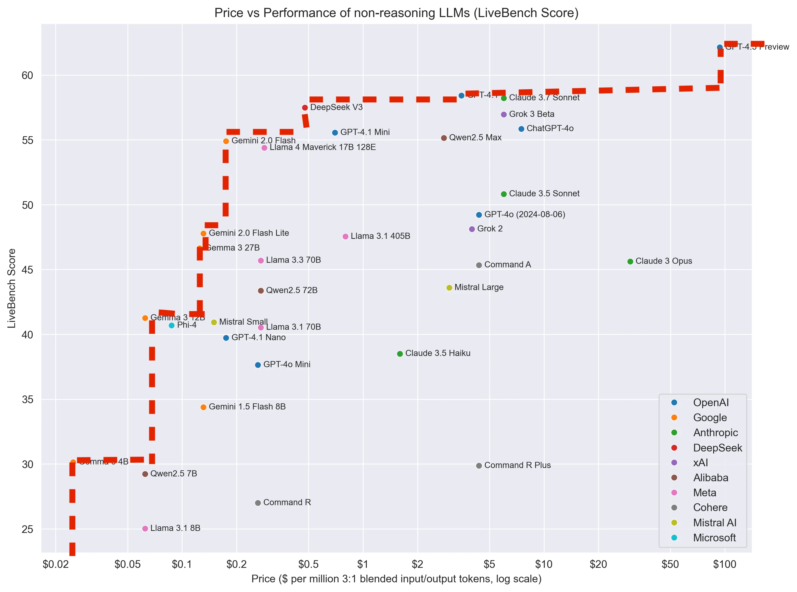

## 模型推荐
- 信息核查/检索（千问 深度研究、秘塔、元宝、perplexity）
- 长上下文（Gemini 2.5 pro）
- 日常使用（Deepseek R1/V3、Grok 3）
- 批量任务（Gemini 2.0 flash）
- 代码生成（Claude 3.7 Sonnet）

## 大模型方向
- Deep Research / AI检索（秘塔、夸克）
- 图片生成下的分图层 / 自由画布 / 文字支持 (chatgpt 4o、Recaft)
- 模型情商 (chatgpt 4.5、豆包)
- 幻觉修复 / 核查 
- 物理仿真能力
- 代码生成能力（cursor）
- 轻量化、端侧 
- 生成类模型测评标准
- 多模态对齐
- AI4Science

## 智能体方向
- 通用Agent产品（Manus）
- 接口标准化-MCP
- 具身智能
- 主动智能
- 多智能体系统 / 社会仿真

## 数据方向
- 数据湖
- 思维链数据

## 参考资料
[非推理 LLMs 的价格与 LiveBench 性能对比](https://www.reddit.com/r/LocalLLaMA/comments/1k0kape/price_vs_livebench_performance_of_nonreasoning/)  

