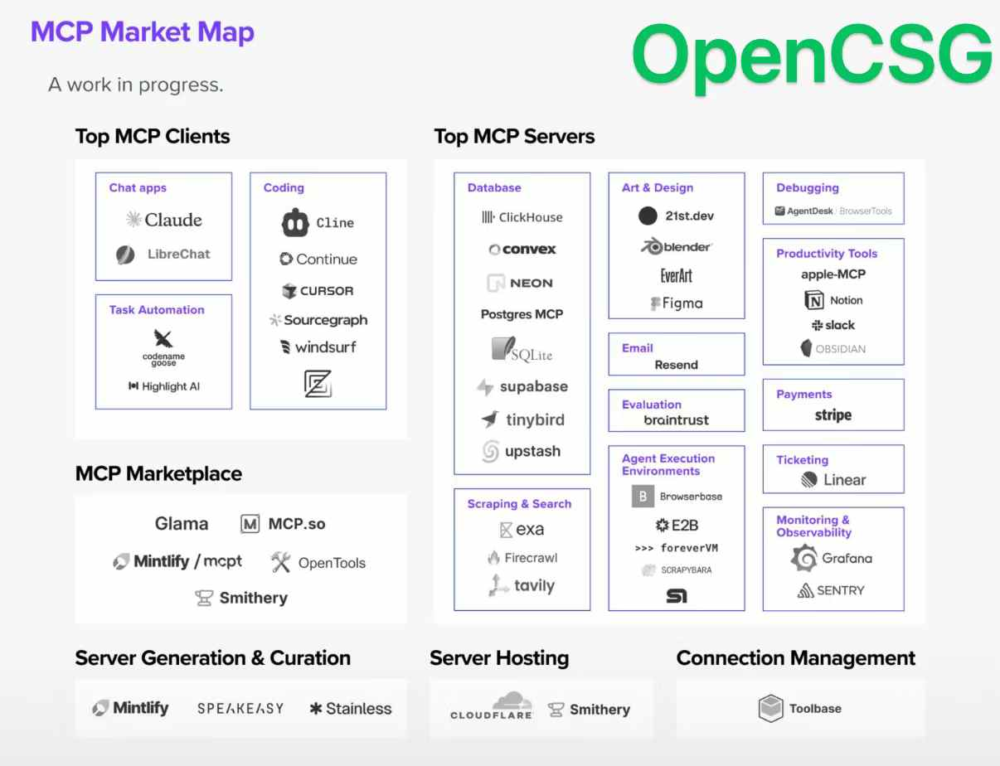

[MCP基础概念](/techshare/101_issue-15-20250320/#一agent-mcp协议)  

:::tip 
MCP 尚停留在开发测试阶段，可体验，但实用性不强，报错很多，门槛高。 
:::

## MCP 客户端
- Claude 桌面版（原生）
- Cursor 
- Cline（VSCode插件） 支持度高
- Trae
- [Coze 空间](https://space.coze.cn/)  使用门槛低，集成的服务少（14个），开发状态
- OpenAI 的 Agent SDK （https://github.com/openai/openai-agents-python）
- [千问](https://chat.qwen.ai/) 预留接口，即将支持  

## MCP 服务
### 汇集站
MCP服务汇集站 https://mcp.so/
魔塔MCP中文社区 https://www.modelscope.cn/mcp
阿里云百炼 https://bailian.console.aliyun.com/?tab=mcp#/mcp-market

### 典型服务
- [blender建模 ](/techshare/101_issue-15-20250320/#blender-mcp) 
- 飞书 https://mcp.so/server/lark-mcp-server/junyuan-qi
- 腾讯位置服务 https://mp.weixin.qq.com/s/zFveK01cEkPAkmXfSU5org
- 高德地图 https://mp.weixin.qq.com/s/yyEFxfzZXpGl7NrqXKxMmw
- Bing中文搜索 https://mp.weixin.qq.com/s/sVUJPq4vNAar1RizcuAWHQ
- 其他：微信聊天总结，实时 Web 搜索集成， Postgres 数据库，Firecrawl网络爬虫，Figma 原型设计 等

## 参考资料
[MCP 哪家强？深度分析 Cline、Cursor、Trae、Coze 四大平台](https://mp.weixin.qq.com/s/MO-Rui3524pBE34RXGYBaQ) 