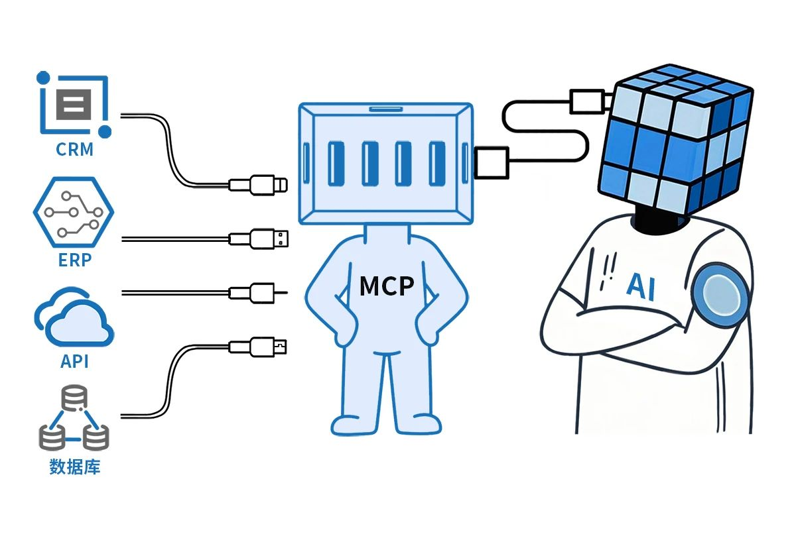
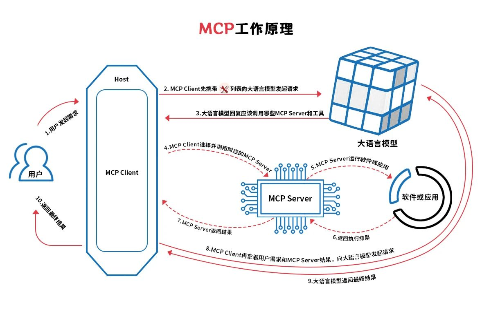
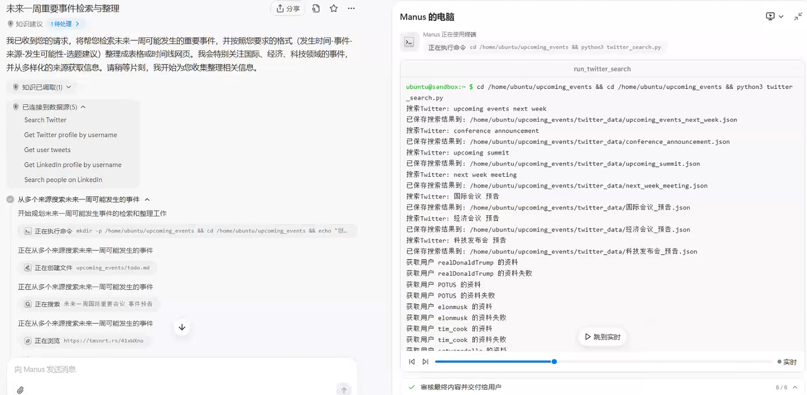
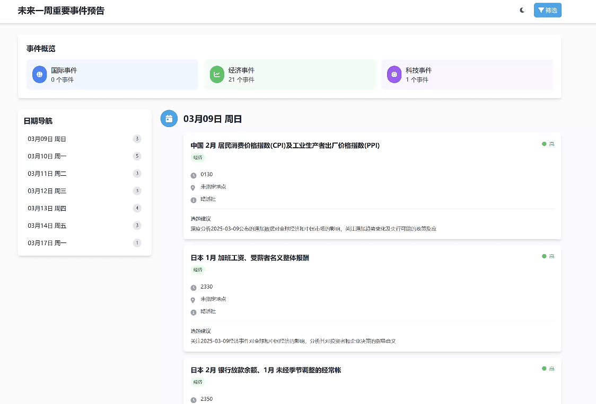
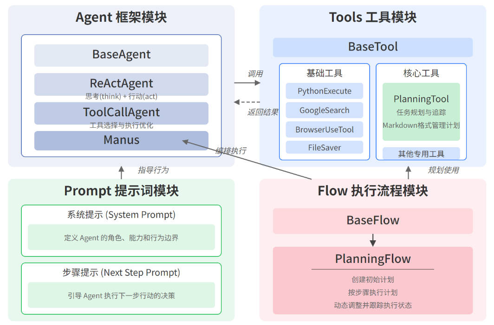
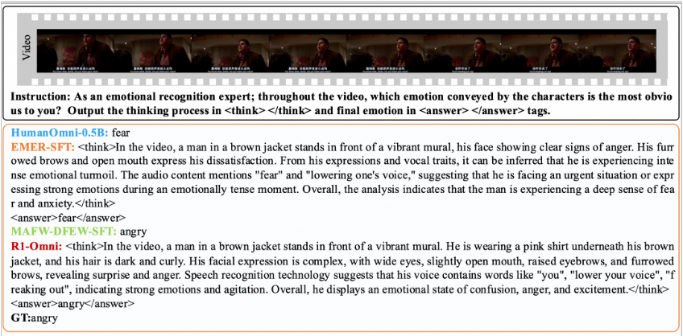

## 一、Agent-MCP协议

2024年11月，Anthropic首次提出「模型上下文协议」，即[MCP](https://github.com/modelcontextprotocol/docs)，赋予了Claude模型超级能力。  

> AI有时候会“答非所问”，原因很简单：它缺少“上下文”。  
> 上下文就像是AI的“记忆”，告诉它你是谁、你在做什么、需要什么。  
> 模型上下文协议，是帮AI找回这些记忆的神奇工具。  

传统上，向AI模型提供上下文是一个复杂的过程，不同的数据源有不同的访问和理解方式。例如，访问文件系统与访问数据库或网络服务是不同的。  
MCP Server 就像一个“跑腿小弟”，负责连接和管理特定的数据源，然后把数据交给AI。它是一个轻量级的程序，专门为某种数据或服务（如文件系统、数据库或在线应用）提供支持。  



| 特性       | API                     | 传统RPA       | MCP协议                     | MCP 优势               |
|------------|-------------------------|---------------|-----------------------------|------------------------|
| 安全性     | 依赖开发者实现，规则不统一 | 无            | 标准化访问控制，用户明确授权 | 更安全可控             |
| 通信方式   | 通常单向获取数据         | 固定脚本       | 支持双向交互，可操作数据，可动态决策 | 功能更强大             |
| AI 优化    | 返回原始数据，需额外处理   | 无            | 提供 AI 友好的工具和提示     | 更易于 AI 处理         |
| 灵活性     | 偏向远程服务，需网络支持   | 规则限定       | 支持本地和远程资源，支持自主探索 | 适用场景更广           |
| 集成复杂度 | 每个服务需定制代码         | 需要专业编程   | 统一协议，即插即用，自然语言驱动 | 开发更简单             |  



### blender-mcp

- **系统要求**：
  - Blender 3.0 or newer
  - Python 3.10 or newer
  - uv package manager
- **集成与配置**：
  - Claude for Desktop Integration，编辑配置，光标集成
  - 安装 Blender 插件
- **项目地址**：[GitHub - ahujasid/blender-mcp](https://github.com/ahujasid/blender-mcp)
  
  

## 二、大模型进展

### 1. Manus

此前外界主要猜测，Manus通过**MCP协议**的标准化接口，连接LLM（大语言模型）与外部资源。但此次发声，季逸超**否认**了该猜测，理由是“Manus早在MCP推出之前就开始开发了”。  
📌 Manus近期宣布与阿里通义千问达成战略合作，承诺将完整功能迁移至国产算力平台。

:::tip
智能体工作流程：① 拆解任务 → ② 搭建框架 → ③ 调用工具 → ④ 整合结果   
:::


**任务1**：帮我检索未来一周可能会发生的事件，按 发生时间-事件-来源-发生可能性-选题建议 建立一个新的表格，也可以是网页（时间线），注意我是中国媒体，特别关注 国际、经济、科技 等事件，来源需要多样，比如谷歌新闻、社交真相平台特朗普的账号、X平台几个重要人物发言 等等，注意事件的去重  
**任务2**：你能帮我分析一下美国当前的虚拟货币市场情况并制作一份ppt/制作一个可交互网页并完成部署吗？  
📌 运行时间30分钟左右

  

| 数据收集 | 数据处理 | 内容创建 |
| --- | --- | --- |
| 使用搜索工具检索国际事件预告 | 按类别和时间组织事件信息 | 创建结构化表格 |
| 使用搜索工具检索经济事件预告 | 验证事件信息并去除重复项 | 设计时间线网页 |
| 使用搜索工具检索科技事件预告 | 评估事件发生可能性 | 审核最终内容 |
| 使用Twitter API获取重要人物发言和预告 |  | 向用户提交成果 |
| 使用LinkedIn API获取行业领袖动态 |  |  |
| 检索特朗普社交平台账号的最新动态 |  |  |

  


**开源项目OpenManus-三小时完成初版**
https://github.com/mannaandpoem/OpenManus

  

- **Agent 框架模块**：
  - BaseAgent：定义了智能体的基础属性（name、memory、system_prompt）和基本行为（执行逻辑、状态检查）。
  - ReActAgent：实现了经典的 "Reasoning + Acting" 模式，先思考后行动，每一步执行都分为 think 和 act 两个阶段。
  - ToolCallAgent：在 ReAct 基础上进一步细化，使 think 阶段专注于工具选择，act 阶段负责执行所选工具。
  - Manus：继承 ToolCallAgent，主要通过定制 system_prompt 和 available_tools 来赋予不同能力。
- **Tools 工具模块**：OpenManus 的行动能力基础，各类工具均继承自 BaseTool。
  - PlanningTool：实现了 Manus 著名的计划功能，用 Markdown 格式管理任务计划并跟踪执行进度。
  - ComputerUse：命令行和计算机操作。
  - BrowserUse：网络浏览和交互。
  - PythonExecute：执行 Python 代码。
  - GoogleSearch：网络搜索。
  - FileSaver：文件读写。
  - PlanningTool：任务规划与追踪。
- **Prompt 提示词模块**：包含了各种 Agent 使用的指令模板。  
```
PLANNING_SYSTEM_PROMPT = """
You are an expert Planning Agent tasked with solving complex problems by creating and managing structured plans.
Your job is:
1. Analyze requests to understand the task scope
2. Create clear, actionable plans with the `planning` tool
3. Execute steps using available tools as needed
4. Track progress and adapt plans dynamically
5. Use `finish` to conclude when the task is complete

Available tools will vary by task but may include:
- `planning`: Create, update, and track plans (commands: create, update, mark_step, etc.)
- `finish`: End the task when complete

Break tasks into logical, sequential steps. Think about dependencies and verification methods.
"""
```
- **Flow 执行流程模块**：负责任务的高层编排和执行流程管理，每步执行前，系统会生成上下文丰富的提示。   
```
step_prompt = f"""
CURRENT PLAN STATUS:
{plan_status}

YOUR CURRENT TASK:
You are now working on step {self.current_step_index}: "{step_text}"

Please execute this step using the appropriate tools. When you're done, provide a summary of what you accomplished.
"""
```
   
Manus的运行机制包括基础版本和高级版本。基础版本直接使用基础工具集执行任务，而高级版本则通过 PlanningTool 对需求进行整体规划，并针对每个子任务动态生成适合的上下文和指令，调用 Manus agent 执行各个子任务，同时维护计划状态和执行进度。  

*Memory 管理：每个子任务执行后进行总结压缩，避免上下文过长  
*Agent 分配：当前主要基于正则匹配和规则

### 2. OpenAI-智能体API

OpenAI推出了**Responses API**，这是对之前的Chat Completions API的一次重大升级，内置了网络搜索、文件搜索和计算机使用能力，将Chat Completions的简单性与Assistants API（计划弃用）的工具使用功能结合到了一起。  

- **网络搜索**：该API中的网络搜索生成的响应会包含指向新闻文章和博客文章等来源的链接。OpenAI支持开发者通过gpt-4o-search-preview和gpt-4o-mini-search-preview直接访问Chat Completions API中经过微调的搜索模型，定价分别为每千次查询30美元和25美元。相关文档：[Web search - OpenAI API](https://platform.openai.com/docs/guides/tools-web-search)
- **文件搜索**：支持多种文件类型、查询优化、元数据过滤和自定义重新排名。使用价格为每千次查询2.50美元，文件存储价格为0.10美元/GB/天，首GB免费。相关文档：[File search - OpenAI API](https://platform.openai.com/docs/guides/tools-file-search)
- **计算机使用**：该工具使用了Computer-Using Agent（CUA）模型，可捕获模型生成的鼠标和键盘操作。Computer Use工具将作为研究预览版在Responses API中提供给使用等级为3-5的选定开发者，使用价格为3美元/100万输入token和12美元/100万输出token。相关文档：[Computer use - OpenAI API](https://platform.openai.com/docs/guides/tools-computer-use)
- **Agents SDK**：用于编排单智能体和多智能体工作流，相比于Swarm有了显著的改进。Swarm是OpenAI去年发布的实验性SDK，并已被开发者社区广泛采用。Agents SDK可与Responses API和Chat Completions API配合使用，提供了易于配置的LLM、智能的控制权交接、可配置的安全检查以及可视化智能体执行跟踪等功能。相关文档：[Agents - OpenAI API](https://platform.openai.com/docs/guides/agents)

📌 OpenAI CEO Sam Altman 在 𝕏 表示他们已经训练出了一个擅长创意写作的模型，不过发布时间待定  
📌 OpenAI 特别指出：「即使数据存储在 OpenAI 上，我们也不会默认使用业务数据来训练我们的模型  

### 3. 通义实验室-开源 R1-Omni

通义实验室开源了R1-Omni，这是**首次将RLVR应用于全模态LLM**。  
**RLVR** - 可验证奖励强化学习，一种新的训练范式，其核心思想是利用验证函数直接评估输出，无需像传统的人类反馈强化学习（RLHF）那样依赖根据人类偏好训练的单独奖励模型（类似于deepseek r1 的GRPO技术）。

> 想象教孩子辨认动物，传统方法是展示图片并告知答案（监督学习），DeepSeek-R1是让孩子自己观察动物习性后总结规律（纯强化学习），而R1-Omni更进一步：当孩子描述"老虎有条纹"，系统会通过百科全书（验证函数）自动核对，同时检查他是否用对了视觉、听觉等多维度信息。这种机制使得AI在情感识别等需要综合判断的任务中，准确率比传统方法提升35%。  
> RLVR技术可以理解为AI的"自主学习神器"。传统AI训练像老师手把手教做题，而RLVR则是给AI一本错题本，让它自己分析哪里错了、为什么错。
> 
  

### 4. 字节-Trae（国内首个 AI IDE）

字节推出了Trae，这是国内首个AI IDE，集成了顶级基座AI模型：Claude 3.5与GPT-4o，用户可以免费使用。不过，Trae的评价并不是很好，特别是编译功能存在问题，代码文件过大时无法使用，且提示慢、加载慢。同类竞品包括Cursor。

## 三、其他

### PDF转交互网页

可以将PDF内容转化为美观漂亮的可视化网页，使用 **Claude 3.7 Sonnet**  
测试案例：https://u5wzyafo1z.yourware.so/

```
我会给你一个文件，分析内容，并将其转化为美观漂亮的中文可视化网页作品集：
## 内容要求
- 保持原文件的核心信息，但以更易读、可视化的方式呈现
- 在页面底部添加作者信息区域，包含：     
* 作者姓名: [作者姓名] 
* 社交媒体链接: 至少包含Twitter/X：  
- 版权信息和年份
## 设计风格
- 整体风格参考Linear App的简约现代设计
- 使用清晰的视觉层次结构，突出重要内容
- 配色方案应专业、和谐，适合长时间阅读
## 技术规范
- 使用HTML5、TailwindCSS 3.0+（通过CDN引入）和必要的JavaScript
- 实现完整的深色/浅色模式切换功能，默认跟随系统设置
- 代码结构清晰，包含适当注释，便于理解和维护
## 响应式设计
- 页面必须在所有设备上（手机、平板、桌面）完美展示
- 针对不同屏幕尺寸优化布局和字体大小
- 确保移动端有良好的触控体验
## 媒体资源
- 使用文档中的Markdown图片链接（如果有的话）
- 使用文档中的视频嵌入代码（如果有的话）
## 图标与视觉元素
- 使用专业图标库如Font Awesome或Material Icons（通过CDN引入）
- 根据内容主题选择合适的插图或图表展示数据
- 避免使用emoji作为主要图标
## 交互体验
- 添加适当的微交互效果提升用户体验：     
* 按钮悬停时有轻微放大和颜色变化     
* 卡片元素悬停时有精致的阴影和边框效果     
* 页面滚动时有平滑过渡效果     
* 内容区块加载时有优雅的淡入动画
## 性能优化
- 确保页面加载速度快，避免不必要的大型资源
- 实现懒加载技术用于长页面内容
## 输出要求
- 提供完整可运行的单一HTML文件，包含所有必要的CSS和JavaScript
- 确保代码符合W3C标准，无错误警告
- 页面在不同浏览器中保持一致的外观和功能
请根据上传文件的内容类型（文档、数据、图片等），创建最适合展示该内容的可视化网页。
```
