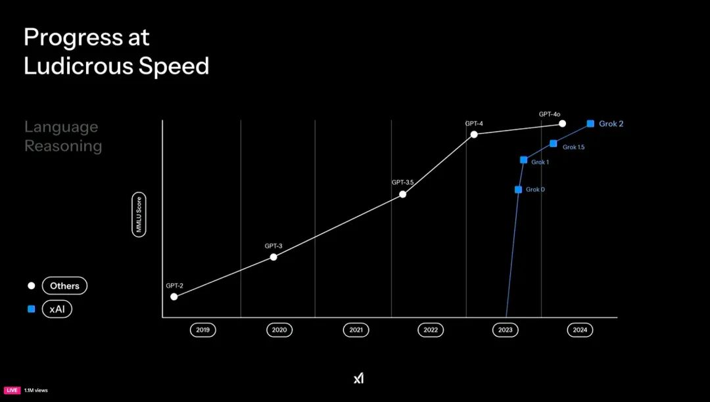
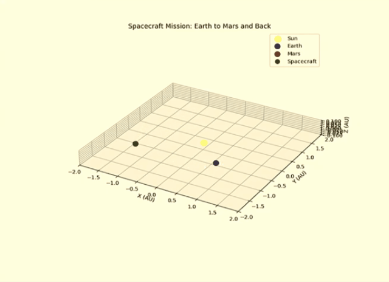
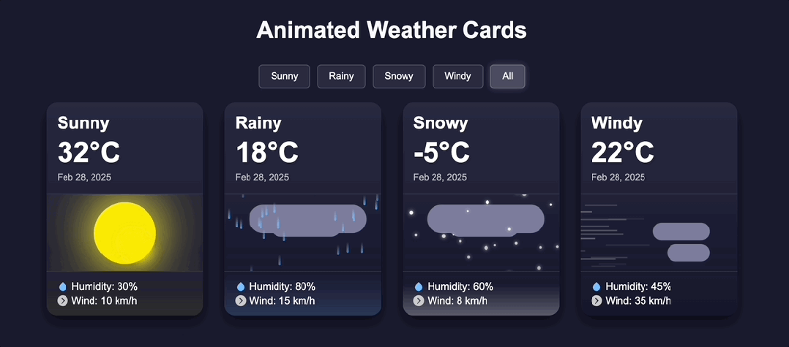
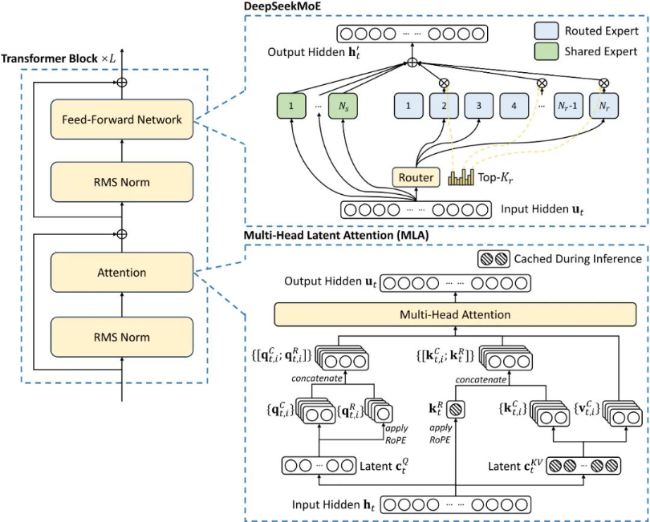
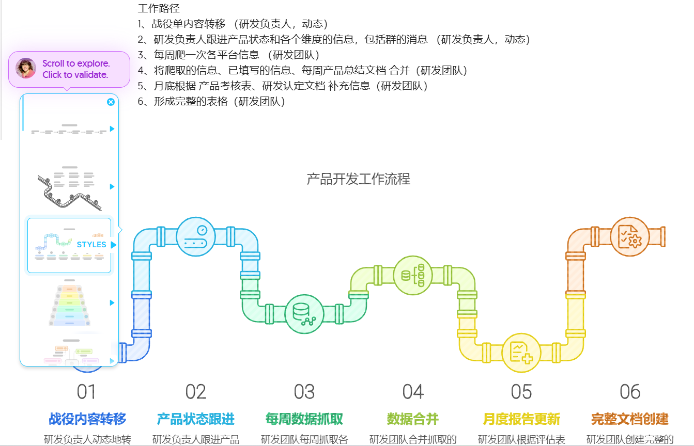

## 一、大模型新进展

### 1. Grok3
https://grok.com/

Grok 3 由 Colossus 超级计算机训练完成，这台计算机是在短短八个月内建成的，搭载了 10 万颗英伟达 H100 GPU，提供了超过 2 亿 GPU 小时的计算资源。xAI 最开始搭建这个 10 万 GPU 集群（全球最大的全连接 H100 集群）用了 122 天，后续拓展到 20 万集群仅用了 92 天。Grok 3 的算力消耗是 DeepSeek-V3 的 263 倍。

**优化策略**：采用合成数据集、自我纠错机制和强化学习。 

 
  
**功能-物理模拟**：模拟航天器任务，生成一个地球发射、火星着陆以及利用霍曼转移轨道返回地球的动画 3D 代码。过程中涉及大量数学和物理模型的计算，Grok 3 很快生成了完整可运行的 3D 动画，直观展示了任务过程中，太阳、地球、火星和飞船之间的位置关系。研究者经过检查后表示：Grok-3 给的答案完全正确！马斯克还说，这就是 SpaceX 真正的探索轨道。他充满信心地表示，两年内，地球和火星就会被连接在一起。

 

- **功能-DeepSearch**：搜索 → 验证 → 修正 → 再搜索  
  - Grok 侧重搜索，OpenAI 侧重研究（$200美元/月）。  
  - Grok 允许用户对互联网和 **X 平台**进行全面搜索。该模式分析大量信息，并通过快速高效的搜索过程提供详细、合理的答案。此外，它的信息检索过程对用户更加透明。可以直接告诉它只使用来自 X 的内容，它会尽量遵守这个要求，因此可控性更强，也更智能。-综合搜索与推理，回答质量接近 Perplexity 的 DeepResearch。
  - OpenAI 是为那些在金融、科学、政策和工程等领域从事密集知识工作并需要彻底、精确和可靠研究的用户而量身打造的。给它一个提示，ChatGPT 将查找、分析和综合数百个在线资源，以研究分析师的水平创建一份**综合报告**。

### 2. Claude 3.7 Sonnet

**全球首个混合推理模型**，一个模型，两种思考方式，API 用户可以精细控制模型的思考时间（控制预算）。  
> “就像人类使用一个大脑来处理快速反应和深度思考一样，推理应该是前沿模型的整体能力，而不是一个完全独立的模型”

**Claude Code** —— 早期阶段，Anthropic 团队不可或缺的工具（搜索和阅读代码、编辑文件、编写和运行测试、提交并将代码推送至 GitHub，以及使用命令行工具），能够一次性完成了通常需要手动工作 45 分钟以上的任务。

 

### 3. ChatGPT 4.5

- OpenAI **最后一个非思维链式大模型**，非常庞大且计算资源密集的模型。
- **价格贵**，每百万输入 75 美元，每百万输出 150 美元（Claude 3.7 Sonnet 每百万输入 3 美元，每百万输出 15 美元）。
- **情商高**，读图和写作能力强，擅长创意任务和数据提取。GPT-4.5 结合了更深层次的世界理解能力和增强的协作能力，使其能更自然地整合思想，在更具温度和直觉性的对话中，更好地适应人类的协作需求。此外，它在理解人类意图、解读微妙线索或隐含期望方面更加细腻，并具备更高的 “情商（EQ）”。在美学直觉和创造力方面也表现更优，特别是在写作和设计方面更为出色。
- OpenAI 员工自己给 GPT-4.5 的评价是，不是一个推理模型，也不是基准测试的杀手，而是一个**低调的研究预览版**，对于复杂的数学、代码和严格遵循指令的任务，更推荐 o1 或者 o3-mini

### 4\. QwQ-Max-Preview（深度思考）
https://chat.qwen.ai
- **阿里 Qwen 首个推理模型**：具有类似 Claude Artifacts 的界面，在主聊天窗口之外，以独立的模块形式展示创建的内容。深度思考 (QwQ) 可以调用图片生成、二维码生成、天气服务等工具，同时可以选择多个工具。
- **即将发布**：QwQ-Max 的正式版，同步发布 Android 和 iOS 端的 APP，并将基于开源软件许可证 Apache 2.0，开放 QwQ-Max 和 Qwen2.5-Max 的权重。Qwen 还将发布更小的模型，比如可以部署在本地设备的 QwQ-32B。

### 5\. 其他

- **字节 - Trae**：中国首个 AI 原生 IDE。
- **腾讯快思考模型 - Turbo S**：通过长短思维链融合，腾讯混元 Turbo S 在保持文科类问题快思考体验的同时，基于自研混元 T1 慢思考模型合成的长思维链数据，显著改进了理科推理能力，实现模型整体效果提升（输入价格为 0.8 元 / 百万 tokens，输出价格为 2 元 / 百万 tokens）。
- **阿里云视频生成大模型万相 2.1（Wan）**：开源，14B 和 1.3B 两个参数规格。
- **Perplexity 「Deep Research」**：免费用户每天五次试用，效果不好。
- **未来展望**：Claude 4、Deepseek R2、Chatgpt 5（5 月）。

## 二、DeepSeek 开源周

### deepseek 开源内容

https://huggingface.co/deepseek-ai/DeepSeek-R1

- **开源内容**：模型权重 + 模型结构、基础推理代码（模型加载、推理示例）、技术文档与示例。
- **未开源内容**：完整训练数据与数据预处理方法、**工程优化细节**（量化、分布式训练框架、超参数调优配置等）。

:::tip
生成式AI，本质上都是让计算机进行一系列矩阵运算，想提高生成式AI算法的执行效率，DeepSeek公布的核心技术从三个方面着手：缩小矩阵规模，提高运算效率，减少等待时间
:::

- **数据准备环节**
  - **3FS**：面向大模型场景的分布式系统，大幅缩减硬盘与 GPU 之间文件传输的 I/O 时间。
  - **Smallpond**：基于 3FS 系统的轻量级数据处理框架，提升数据传输效率。  

- **模型训练环节**

  - **FlashMLA**：为 Hopper 高性能 AI 芯片设计的「多层注意力解码内核」，支持变长序列处理，优化 MLA 解码和分页 KV 缓存，提高 LLM 推理效率。内存带宽高达 3000 GB/s（传统方法约 1500 - 2000 GB/s），计算性能达到 580 TFLOPS（传统方法约 260 TFLOPS）。[GitHub - deepseek - ai/FlashMLA: FlashMLA: Efficient MLA decoding kernels](https://github.com/deepseek-ai/FlashMLA)
  - **DeepGEMM、DeepEP、DualPipe**：与模型训练加速相关，提升训练效率。
    - **DeepGEMM**：专为 FP8 通用矩阵乘法设计的库，具有细粒度缩放功能。
    - **DeepEP**：为混合专家模型（MoE）和专家并行（EP）设计的高性能通信库，要求 Hopper GPU、Python 3.8 及以上、CUDA 12.3 及以上、PyTorch 2.1 及以上，用于节点内通信的 NVLink，用于节点间通信的 RDMA 网络。[GitHub - deepseek - ai/DeepEP: DeepEP: an efficient expert - parallel communication library](https://github.com/deepseek-ai/DeepEP)

- **模型推理环节**
  - **EPLB**：MOE 模型中的专家并行负载均衡推理算法，优化模型推理速度和精度。

## 三、数据公司

### 1. Databricks
https://www.databricks.com/
- **公司背景**：2013 年成立，总部位于美国旧金山，由 Apache Spark 的创始团队成员创立。专注于基于云计算的大数据处理和人工智能平台服务。
- **核心技术与产品**：
  - **Lakehouse 架构**：在数据湖的基础上引入数据仓库的管理机制，结合数据湖的灵活性和数据仓库的高性能优势。数据湖存储所有数据，成本低但管理和查询难度大；数据仓库存储结构化数据，管理和查询效率高。
  - **对 Apache Spark 的改进提升**：
    - **Catalyst 优化器**：优化查询执行，提升数据查询和处理速度。
    - **Photon 引擎**：自研高性能查询引擎，提升 Spark SQL 和 Spark DataFrame 的运行速度。
    - **自适应查询执行（AQE）**：动态调整查询计划，优化数据处理效率。
    - **全托管云平台**：提供一站式云服务，用户无需担心硬件、网络、安全等复杂问题。
  - **Mosaic AI 框架**：2024 年推出，帮助企业构建和管理 AI 项目，通过检索增强生成（RAG）模式，结合企业内部数据和大型语言模型（LLM），提供更准确、安全且受控的生成式 AI 应用。
  - **通用大语言模型 DBRX**：在开源模型中表现优异。
- **市场地位**：
  - 2024 年估值达 620 亿美元，成为数据和 AI 领域备受瞩目的公司。
  - 全面转向无服务器架构，简化资源管理，优化成本和性能。
- **动态**：2024 年开源数据治理框架 Unity Catalog，上线 Lakehouse Federation 功能，允许企业跨多个数据源进行查询。

### 2. Rockset

- **公司背景**：2016 年成立，由前 Facebook 工程师创立。2024 年 6 月被 OpenAI 收购，以增强其 AI 产品的数据检索和实时分析能力。
- **核心技术与产品**：
  - **Converged Index™**：核心是 Converged Index™，能够实时处理和分析结构化及半结构化数据，支持向量、文本、地理空间和 JSON 等多种数据类型的索引。结合行索引、列索引和倒排索引，自动选择最优索引方式，支持多种数据类型，实时更新和查询，用户无需手动创建或更新索引。
  - **无服务器架构与实时分析**：提供无服务器的搜索和分析解决方案，用户无需管理底层基础设施，实现低延迟、高并发的实时数据分析。
- **市场地位**：
  - 在实时数据处理和灵活查询方面表现出色，尤其擅长处理大规模半结构化数据。
  - 与 Snowflake 等竞争对手相比，在实时数据处理和自动索引方面更具优势。
- **动态**：被 OpenAI 收购后，技术和团队将整合到 OpenAI 产品中，提升其数据检索基础设施的性能。

## 四、其他

### 1. napkin
https://www.napkin.ai/
将文本转换为视觉内容，如图表、流程图等，支持多种格式导出（PNG、PDF、SVG）。提供丰富的编辑功能，如图标、装饰器、连接器、颜色和字体等。

### 2. CogView4
0304智谱推出首个支持生成汉字的开源文生图模型——CogView4。（3月13日上线）,首个支持中英双语提示词输入，擅长理解和遵循中文提示词。

