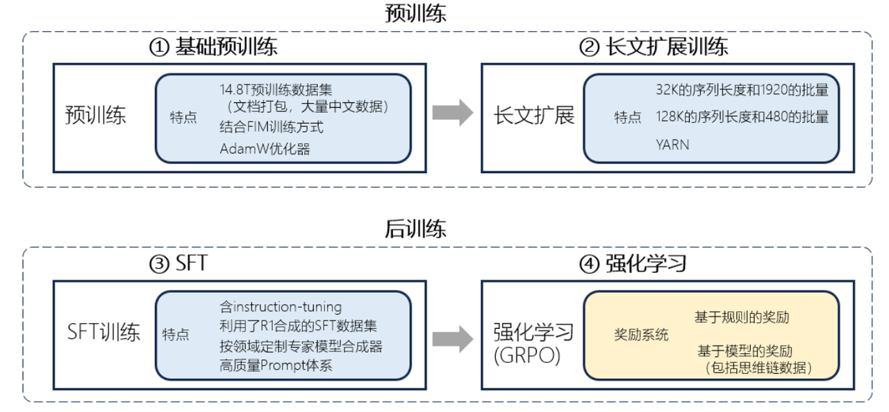
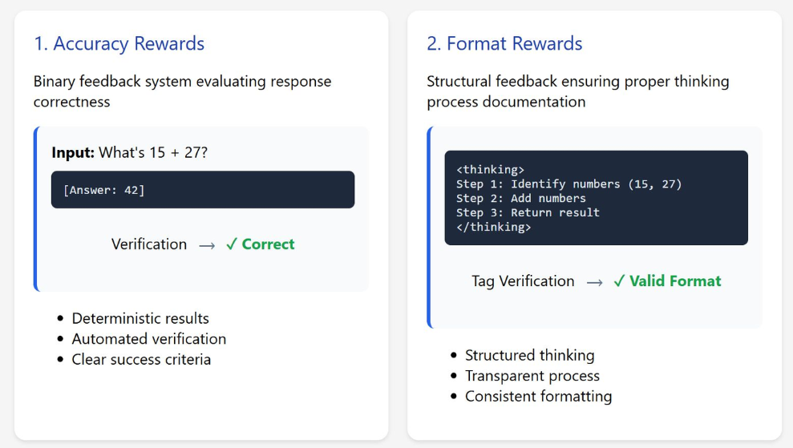
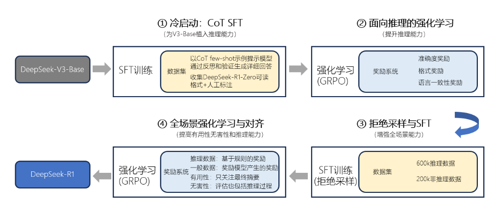
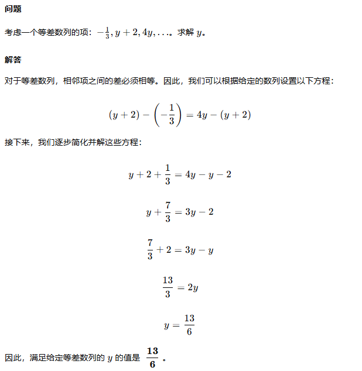
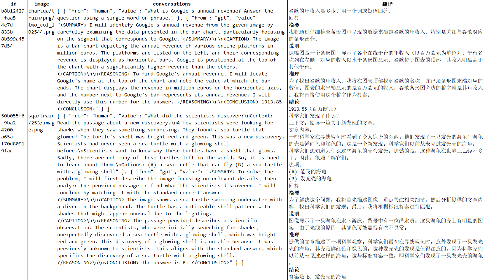
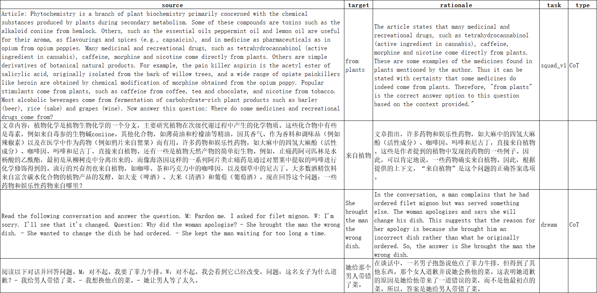
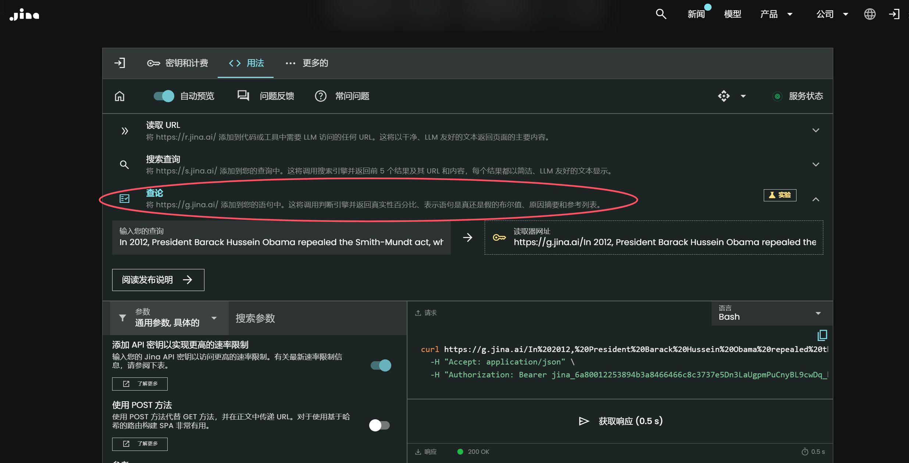
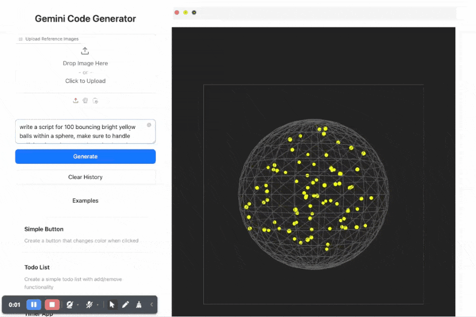
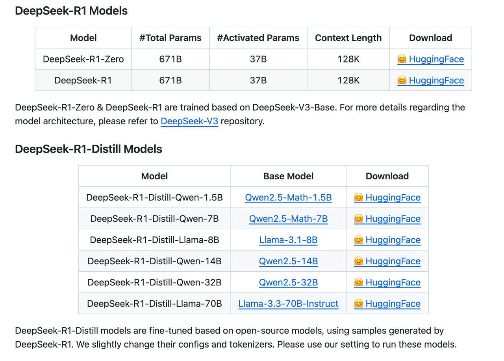

## 一、DeepSeek 技术拆解

### 1. DeepSeek-V3

#### 训练过程

- **基础预训练：高质量的数据结构与数据投喂顺序**
  提高数学和编程样本的比例来优化预训练语料库；基于中国互联网可用的语料库整合了更多的中文数据；优化数据处理 / 过滤算法，在保持语料库多样性的同时最大限度减少信息冗余。

- **长文拓展训练**
  在预训练阶段后，对 DeepSeek-V3 进行了两次上下文长度扩展。  
  在第一阶段，使用 32K 的序列长度和 1920 的批量来执行 1000 步训练；在第二阶段，采用 128K 的序列长度和 480 个序列的批量大小执行 1000 步训练。

- **SFT（指令精调）**
  **指令精调数据集**，包括 1.5M 个实例，跨多个域，每个域都量身定制了不同的数据合成方法，利用 DeepSeek-R1 模型合成与推理相关的 SFT 数据集（基于 R1 来 SFT V3，再基于 V3 冷启动 R1）。  
  建立高**质量提示体系**，引导模型形成自身的反馈与验证机制。  
  对于非推理数据（例如创意写作、角色扮演和简单的问答），利**用 DeepSeek-V2.5 生成数据**，并通过人工注释验证数据的准确性。
- **强化学习**：
  - 奖励模型（基于规则 + 模型，偏好数据 [最终 + 过程]）与组相对策略优化（GRPO）[不再需要一个显式的价值网络]。

#### 创新

- **架构提升 - DeepSeekMoE 架构（改进的混合专家）**
  - DeepSeek-V3 拥有 6710 亿参数，但在实际运行中，每个输入仅激活 370 亿参数，这种选择性激活的方式大大降低了计算成本，同时保持了高性能。贡献了 4 倍以上的计算效率提升。
  - 细粒度专家 + 通才专家，不再使用少数大专家的结构，而是使用大量极小的专家结构。
  - 将知识空间进行离散细化，以更好地逼近连续的多维知识空间。
  > *MoE减少计算量的代价是不同专家模型的参数重复和总参数量增加，这意味着更大更贵的HBM成本（高带宽存储器），外界传言的MoE模型可以更小，其实是指的MoE模型蒸馏的Dense模型可以兼顾参数量和推理性能  

- **架构提升 - 多头潜在注意力（MLA）**
  - 对 KV 的有损压缩，显著减小 KV 缓存（MLA 是目前开源模型里显著减小 KV 缓存大小的最佳方法），实现潜空间表征。该架构在 DeepSeek-V2 中已经得到验证，能够实现高效的训练和推理。贡献了 2 - 4 倍的计算效率提升。
  - 为与 MLA 技术的低秩 KV 压缩兼容，改进编码方式 RoPE，使 V2 / V3 / R1 获得了长上下文的外延能力。  
.png)
  
- **训练框架 - 人工智能基础设施（AI Infra）**
  软（HAI-LLM）硬（HFReduce）件协同优化。引入 FP8 混合精度训练框架（首次在超大规模大模型训练上验证）；设计了 DualPipe 算法来实现更高效的流水线并行，开发了高效的跨节点 All-to-All 通信内核；对显存使用进行优化。实现了训练的加速和 GPU 内存使用的减少（V3 应用了 16 路流水线并行（PP）、跨越 8 个（服务器）节点的 64 路专家并行（EP）和 ZeRO-1 数据并行（DP））。


### 2. DeepSeek-R1-Zero（R1 的初始阶段）

基于**DeepSeek-V3-Base**，**仅通过大规模强化学习（RL） 训练（第一个）**，无需有监督微调 (SFT，需要大量人工标注数据) ，通过各种**思维链（CoT，Chain of Thought）数据**特别是Long CoT数据来激活模型的推理能力。
> 复杂的推理任务可能超出了普通人类的能力。无SFT的纯强化学习方法也许可以使模型能够涌现出超越传统人类思维上限的超级推理能力。  
> 按照NLP领域对语言的理解，人类的自然语言并不是最完美的推理语言。在R1-Zero的进一步进化过程中，或许可以构建出更适合推理的混合语言IR，建立更高效的推演体系。  
> 顿悟时刻：无需明确的教模型如何解决问题，只需为其提供适当的激励，模型就会自主形成解决问题的策略。  

奖励模型（准确度+格式）


### 3. DeepSeek-R1
  

R1 是以 **V3-Base** 为基础构建的（冷启动），DeepSeek-R1 采用了多阶段训练方法，加入了 SFT，而不是采用纯粹的强化学习，R1 从一小组精心挑选的示例数据（称为**冷启动数据**）进行有监督微调（SFT），再进入强化学习。改善了 DeepSeek-R1-Zero 的语言可读性和连贯性。

#### 训练过程

1. **冷启动（Cold Start）CoT SFT**
   - 为构建少量的长 CoT 数据，DeepSeek 探索了几种合成方法：使用长 CoT 的 few-shot 提示作为示例，直接提示模型通过反思和验证生成详细回答，以可读格式收集 DeepSeek-R1-Zero 输出，并通过人工标注员的后处理来完善结果（数千个冷启动样本）。
   - 其中可读模式指为每个回答在末尾包含一个摘要，并过滤掉不易阅读的部分。其输出格式为 `|special_token|<reasoning_process>|special_token|<summary>`。
2. **面向推理的强化学习**
   - 采用与 R1-Zero 相当的强化学习训练流程，基于 GRPO 进行强化学习，根据准确度和格式进行训练奖励。
   - 此阶段主要提升模型的推理（Reasoning）性能，特别是在编码、数学、科学和逻辑推理等推理密集型任务。
3. **拒绝采样与 SFT**
   - 分批进行了两个 epoch 的精调，样本量为 800k（600k 推理数据和 200k 非推理数据）。
   - 600k 推理数据的生成：利用已有的从上一轮强化学习训练的模型状态（即检查点）生成多个候选回答，进行拒绝采样（通过自动化的奖励模型，只保留符合目标分布（即高质量回答）的样本，而拒绝其他样本）。过滤掉混合语言、长段落和代码块数据。
   - 200k 非推理数据的生成（如写作、事实问答、自我认知和翻译等）：采用 DeepSeek-V3 流程并复用 V3 的部分 SFT 数据集。
4. **面向全场景的强化学习与对齐**
   - 以提高模型的有用性和无害性。
   - 对于推理数据，利用基于规则的奖励来指导数学、代码和逻辑推理领域的训练过程。
   - 对于一般数据，采用奖励模型来捕捉复杂微妙场景中的人类偏好。

## 二、思维链数据

### 开源数据集

#### NuminaMath-CoT（数学）

- **发布方**：Numina，一个开放的科学研究合作组织，非营利组织，对 AI 和数学充满热情的集体。
- **下载地址**：[Project Numina](https://projectnumina.ai/)
- **发布时间**：2023 年（7 个月前更新）。
- **大小**：约 1GB（包含数千个数学问题及逐步推理过程），大约 860k 道数学题，其中每个解决方案都以思维链（CoT）方式格式化。数据集的来源范围从中国高中数学练习到美国和国际数学奥林匹克竞赛问题。数据主要来自在线试卷 PDF 和数学论坛。
- **字段**：问题来源、问题描述、解答步骤和答案、包含问题和解题步骤的 JSON 格式列表。
- **处理步骤**：（a）原始 PDF 的 OCR，（b）分割成问题 - 解决方案对，（c）翻译成英文，（d）重新对齐以生成 CoT 推理格式（使用 GPT-4o 对提取的文本解决方案进行格式重排），以及（e）最终答案格式。


| source        | problem                                                                 | solution                                                                 | messages                                                                                                                                                                                                 |
|---------------|--------------------------------------------------------------------------|--------------------------------------------------------------------------|----------------------------------------------------------------------------------------------------------------------------------------------------------------------------------------------------------|
| synthetic_math | Consider the terms of an arithmetic sequence: $-\frac{1}{3}, y+2, 4y, \ldots$. Solve for $y$. | For an arithmetic sequence, the difference between consecutive terms must be equal. Therefore, we can set up the following equations based on the sequence given: $ (y + 2) - \left(-\frac{1}{3}\right) = 4y - (y+2) $ Simplify and solve these equations: $ y + 2 + \frac{1}{3} = 4y - y - 2 $ $ y + \frac{7}{3} = 3y - 2 $ $ \frac{7}{3} + 2 = 3y - y $ $ \frac{13}{3} = 2y $ $ y = \frac{13}{6} $ Thus, the value of $y$ that satisfies the given arithmetic sequence is ${\frac{13}{6}}$. | ```[ { "content": "Consider the terms of an arithmetic sequence: $-\\frac{1}{3}, y+2, 4y, \\ldots$. Solve for $y$.", "role": "user" }, { "content": "For an arithmetic sequence, the difference between consecutive terms must be equal. Therefore, we can set up the following equations based on the sequence given:\n\\[ (y + 2) - \\left(-\\frac{1}{3}\\right) = 4y - (y+2) \\]\n\nSimplify and solve these equations:\n\\[ y + 2 + \\frac{1}{3} = 4y - y - 2 \\]\n\\[ y + \\frac{7}{3} = 3y - 2 \\]\n\\[ \\frac{7}{3} + 2 = 3y - y \\]\n\\[ \\frac{13}{3} = 2y \\]\n\\[ y = \\frac{13}{6} \\]\n\nThus, the value of $y$ that satisfies the given arithmetic sequence is $\\boxed{\\frac{13}{6}}$.", "role": "assistant" } ]``` |
  
  

#### LLaVA-CoT-100k（图片）

- **发布方**：PKU-YUAN-Lab（袁粒课题组 - 北大信工，北大、清华、阿里达摩院和莱赫大学）。
- **下载地址**：[GitHub - PKU-YuanGroup/LLaVA-CoT](https://github.com/PKU-YuanGroup/LLaVA-CoT)
- **发布时间**：2024 年（3 周前更新）。
- **大小**：约 10GB（包含 100,000 个多步骤推理任务）。
- **字段**：id、图片、对话（问题、回答 [摘要、说明、推理、结论]）。
- **数据集构建**：整合了来自几个广泛使用的 VQA 数据集，总共达到 99k 个图像问答对（每对可能包含一轮或多轮提问），引导 GPT-4o 分阶段使用精心设计的提示生成响应数据。  

  

#### CoT-Collection（综合）

- **发布方**：kaist-ai（韩国科学技术院 - 韩国首个提供人工智能硕士、博士学位的学院）。
- **下载地址**：[kaist-ai/CoT-Collection · Datasets at Hugging Face](https://huggingface.co/datasets/kaist-ai/CoT-Collection)
- **发布时间**：2023 年。
- **大小**：约 3GB（包含多种类型的推理任务）。
- **字段**：问题、答案、思考过程、任务、类型。
- **简介**：CoT Collection 提供了来自 Flan Collection（谷歌大模型指令微调数据集）的 1060 个任务中的 184 万条思维链增强数据。包含自然语言推理、抽取式问答、封闭书籍问答、科学、分类、算术、程序执行、对话、伦理学、常识推理、多项选择题问答。（使用 Flan-T5 作为基础模型，并在 COT COLLECTION 上进行 CoT 微调以获得 CoTT5，在训练和评估过程中添加了触发短语“让我们一步步思考”）。

 


## 三、其他信息

### 1. 信息核查
https://jina.ai/reader/
 

```json
"factuality": 0.9,
"result": true,
"reason": "The references indicate that Trump has made statements about imposing tariffs on the EU, with confirmations that tariffs will 'definitely happen.' Additionally, the EU has prepared to respond to these potential tariffs. This suggests that the statement about Trump deciding to impose tariffs on Europe in 2025 is supported by the available information, as multiple sources confirm his intentions and the likelihood of implementation.",
```

### 2. 视觉理解 - 检索
2月6日谷歌发布，2.0 Flash Thinking Experimental。

  - 结合了 2.0 Flash 的速度与性能，并增强了推理能力，能将提示分解为多个步骤。
  - 可以与 YouTube（首个接入 YouTube 的推理模型）、Google 搜索和 Maps 等应用互动。
   
  - 图像和音频输出功能以及多模态实时 API 计划将在未来几个月内全面推出。
  - 物理模拟能力。
   

### 3. 闪电云拆解
https://mp.weixin.qq.com/s/v9Vme4oj_yTSQotuMtB17A
- **总结**：闪电云很可能是本地部署了一个试验性质的开源蒸馏模型，推测其参数量为 1.5B，且未结合场景进行微调等其他优化工作，只是提供了调用能力。
- **原因**：
  1. DeepSeek R1 完整模型参数量为 671B，对于硬件的需求巨大，在开源很久以后才有几家大厂商复现部署出来。
  2. DeepSeek R1 提供了若干试验性质的蒸馏模型，即基于论文里提到的强化学习方法，对通义千问、Llama 的开源模型进行微调，提供的模型参数量为 1.5B、7B、8B、14B、32B、70B。
  3. 根据文章中的截图，DeepSeek 的思考过程语言表达混乱、错别字较多、幻觉严重，因此不可能是调用官方在线 API，更可能是本地部署了一个 1.5B 的小型蒸馏模型，推测其基本无法支撑业务的使用。
- **思考**：
  1. R1 的完整模型参数量为 671B，需要很大的硬件资源，且需解决多卡互联的复杂工程问题，我们自身无法部署。
  2. 蒸馏模型可以部署，但性能很差。DeepSeek 开源的蒸馏模型是试验性质的，用于证明使用了论文中提及的强化学习方法同样可以提高其他模型的推理能力。但这些模型与完整的 R1 性能差距较大，过小参数量的甚至不具备最基础的语言表达能力。
  3. 若要部署一个 8B 及以下模型，当前的设备 2（3060Ti）即可运行，14B 及以上的模型需要 4090 以上的显卡才可部署。

 