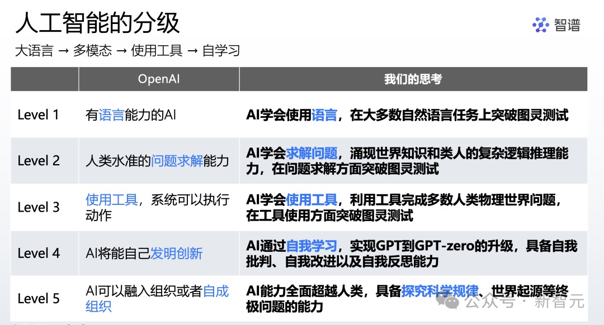
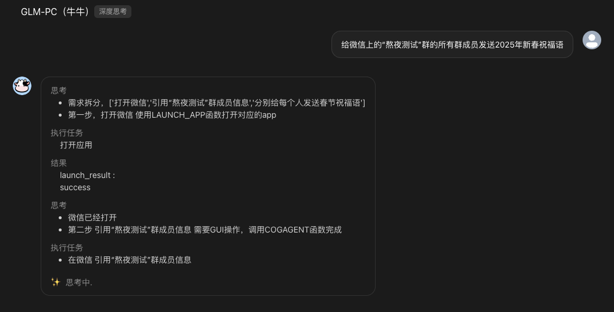
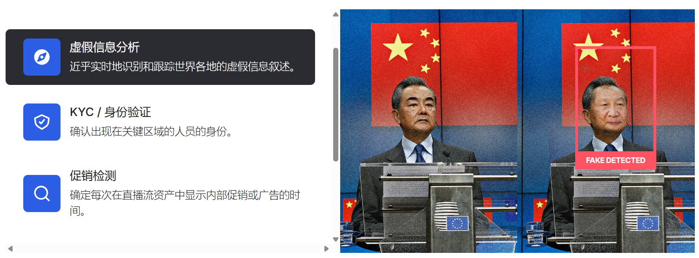
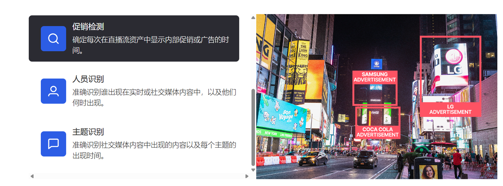

## 一、OpenAI 智能体

OpenAI总裁Brockman-2025是智能体之年。  
- **Tasks**：ChatGPT的Agent初登场。
- **Operator**：能够独立为你完成工作——只需给它一个任务，它就会执行-暂时只面向Pro用户，一个月200刀（约合人民币1458元）。

:::info
**OpenAI 的 5 步计划**：（2024.7，OpenAI 表示自己还只处于 Level 1 阶段，正在靠近 Level 2）
  - Level 1：Chatbots，AI 可以以对话的方式与人互动。
  - Level 2：Reasoners，AI 可以解决人类水平的问题。
  - Level 3：Agents，AI 可以作为系统执行一些行动任务。
  - Level 4：Innovators，AI 可以开发创新性的 AI。
  - Level 5：Organizations，AI 可以完成一个组织完成的工作。  
:::

 

> 智谱-张鹏：截至 2024 年 11 月，LLM 已经初步具备了人类与现实物理世界互动的部分能力。智能体将会极大地提升 L3 使用工具能力，同时开启对 L4 自我学习能力的探索。

### 1. Tasks
  把要 ChatGPT 帮你执行的任务，包括任务内容、执行时间，说人话告诉 ChatGPT 就行，系统会根据用户的 prompt 主动建议其他任务，批准后执行。**至多可以同时创建 10 个任务**。在设定好这些 task 后，系统会**通过网页、桌面和移动设备发送通知**。
https://mp.weixin.qq.com/s/uVct78hOATanCHbP4kutrA

### 2. Operator
Operator**内嵌了自己的浏览器**,与 Google 通过扩展、API 等方式调用工具的思路不同，Operator 更接近人的操作，可以执行鼠标移动、点击、输入和视觉功能相结合，而不是通过调用 API 实现。

  给它一个购物清单，Operator 就能完全自主地帮你买好东西。
  - 从 All recipes 上找到一份蛤蜊扁面条的食谱，然后把所有的食材都放到我 Instacart 的购物车里。
  - 帮我从小红书找二手沙发床并留言提示我。
  - 也能同时运行多个任务，就像是打开多个网页那样，比如让它在 Etsy 上订购个性化的搪瓷马克杯，同时在 Hipcamp 上预订露营地。
  
遇到登录、支付等操作时，Operator 会将操作权交还给用户。

### 3. 智谱 GLM-PC
 

### 4. 技术原理
监督学习（感知计算机、精准点击）+ 强化学习（推理、纠错、适应突发事件）。
  - **Operator**：基于文本的思维链进行推理。底层使用了一个全新的模型Computer-Using-Agent（CUA）。
  - **智谱 GLM-PC**：代码式的思维链。

OpenAI 似乎正在开发一个代号为 **Caterpillar** 的项目，该项目可能与任务集成，使 ChatGPT 能够搜索特定信息、分析问题、总结数据、浏览网站、访问文档——并在任务完成后向用户发送通知。

## 二、以色列公司 VIDROVR
https://www.vidrovr.com

成立于2016年，哥伦比亚大学数字视频和多媒体实验室的博士生Joseph Ellis和Daniel Morozoff创立，专注于视频内容分析和机器学习。提供多模式计算机视觉和机器学习系统，用于索引、标记和理解视频。
- **快速检索和分析新闻视频**，自动生成相关元数据，在就一个话题写某科技公司 CEO 的评论，可以使用 Vidrovr 搜索其他 CEO 对相同话题的评论视频。
- **近乎实时地识别和跟踪世界各地的虚假信息**
 
- **促销检测**
 

### 视频认知科学实验室

Vidrovr 与 MIT Media Lab 共建 “视频认知科学” 联合实验室（Video Cognitive Science Lab）。

**核心目标**：构建一个双向翻译器（人类的认知规律 & 机器的算法），一方面将人类的认知规律编码为机器可理解的算法，另一方面将机器的洞察解码为人类决策的辅助工具。  

**实验室的核心技术与成果**
1. **视频认知指纹技术**
  通过分析用户观看视频的行为（如注意力焦点、停留时间等），在短短 5 分钟内就能揭示用户的深层心理特征和潜在兴趣。这项技术不仅能够捕捉用户的兴趣偏好，还能洞察其潜在的心理状态。——可以考虑和微博等平台合作，收集用户的停留时间等信息，对用户的偏好、认知有更全面精准的了解。
   - **行为数据收集**：记录用户观看视频时的行为，如注意力焦点（停留时间较长的画面）、观看时长、暂停或快进等操作。（多模态、会更关注深层次心理分析、增加脑电波 & 眼动追踪等生理数据分析）
   - **多模态数据融合**：“视频认知指纹” 技术结合了多模态数据，包括视觉、音频、生理信号等，而不仅仅是视频内容的视觉或音频特征。例如，通过眼动追踪或脑电波分析，该技术可以更全面地评估用户的情绪和认知反应。
   - **特征提取**：利用机器学习算法，从这些行为数据中提取关键特征，例如用户对某些主题或场景的关注频率。
   - **指纹生成与分析**：将提取的特征组合成一个“指纹”，并分析其背后的心理特征。  传统的视频指纹技术主要用于内容识别和版权保护，通过提取视频的视觉或音频特征生成“指纹”，用于相似性检测。而“视频认知指纹” 技术则专注于用户行为分析，揭示用户的心理特征，具有更强的个性化和心理洞察能力。
1. **视频内容的深度分析与理解**
   - **场景和物体识别**：利用计算机视觉技术识别视频中的场景和物体，提取关键信息。
   - **语音内容提取与分析**：结合语音识别技术，从视频中提取语音内容并进行语义分析。
   - **情感与行为分析**：通过分析用户的观看行为和生理反应（如眼动追踪、脑电波等），评估用户的情绪反应。

## 三、预测向的感知技术

### 1. 分析思路

1. **【消息】发文中对节点的预告**
   中美：三手消息 [境内舆论场] - 二手消息 [外媒] - 一手消息 [发文 / 直播]。
2. **【惯例】历史规律**
  缺乏过往数据，先以找资料的方式逐个领域摸路径，同时指导当下数据积累 + 时间线梳理。

### 2. 技术路径 1.0

**数据采集与挖掘**

1. **针对思路 1**
   - 确定平台（哪几个外媒、哪几个人、动态新闻、直播？）、关键词（专人维护）、范围 - 常态化数据入库
   - 数据数量与质量把控算法，每天？条 - 实时数据流
   - 未来节点数据抽取算法
   - 节点数据对齐算法（含跨平台数据）
   - 节点热度计算算法
2. **针对思路 2**
   - 确定数据源（新闻、书、自传、社媒）
   - 历史数据采集 / 当下监测源更新
   - 特征工程，设定一定的维度，文本特征、时间特征、地理特征等
   - 事件规律推理算法（考虑可解释性）
3. **结合 1 和 2 推理**
   - 融合 1 和 2 的结论，形成实时更新的未来事件推理文档
   - 事件发生可能性推理算法（考虑可解释性）
   - 事件关联算法
   - 标注含：来源、地域、主题、是否发生、发生可能性、关联事件等
4. **输入当下环境，进一步修正**
   - 确定可以描述当下环境的数据是什么（行业报告、政策文件）
   - 推理融合算法（考虑可解释性）
   - 修正未来事件推理文档
   - *另需要考虑 反馈机制*

### 3. 技术路径 2.0

**历史规律总结**

**KeyPoint**

- 事件筛选
- 事件数据采集、分析、推断
- 构建图谱入库

**下文以舆情处理为例：**

1. **历史事件结构化建模**
   - **构建历史事件知识图谱**
     - 事件要素拆解：将历史事件分解为「主体 - 行为 - 后果 - 舆论反应」的原子结构。例如，分析 2021 年郑州暴雨事件时，提取“政府响应速度”“社交媒体求助信息占比”“次生灾害（如隧道积水）”等关键节点。
     - 关联网络构建：使用图数据库（如 Neo4j）建立事件间的因果关系（如“防疫政策收紧→失业率上升→社会矛盾激化”）和类比关系（如不同年代的食品安全事件传播路径对比）。
   - **标签化分类与模式库建设**
     - 对历史舆情事件打标签（如「公共安全 - 基础设施事故 - 情感烈度 > 80%」），形成可检索的案例库。例如，2023 年齐齐哈尔体育馆坍塌事件与 2016 年深圳滑坡事件的舆情扩散速度可交叉比对。

2. **历史规律提取与复用**
   - **周期性与季节规律挖掘**
     - 时间序列分析：识别特定事件的时间周期性。例如，中国春节前的农民工讨薪舆情、夏季暴雨季的城市内涝报道，均可通过 LSTM（长短期记忆网络）预测爆发概率。
     - 社会时钟效应：统计历史事件在政治周期（如两会前后）、文化周期（如重大纪念日）中的分布规律。例如，重大政策发布后 48 小时内，对立观点的碰撞概率上升 23%（基于 2019 - 2023 年微博数据）。
   - **群体行为模式映射**
     - 情绪传染模型：量化历史事件中情绪传播的“临界点”。如某一指标超过阈值时，将引发线下活动。
     - 模仿学习机制：分析同类事件的“模版化传播”特征。例如，近年环保抗议事件中，短视频平台“举身份证举报”的行为模仿率达 67%。

3. **因果推理与反事实分析**
   - **因果发现算法应用**
     - 使用贝叶斯网络或 DoWhy 库，从历史数据中挖掘变量间的因果链。例如，通过分析 2018 年长春长生疫苗事件，可量化“政府通报延迟 1 天→社交媒体谣言数量增长 300%”的因果关系。
     - 反事实推演：假设历史事件中某个变量改变（如监管部门提前介入），通过双重机器学习（Double ML）预测结果差异，辅助制定干预策略。
   - **类比推理引擎开发**
     - 训练 AI 模型识别新旧事件的相似性特征。例如，将 2024 年邯郸未成年人案件与 2019 年大连 13 岁男孩杀人案对比，模型可自动提取“未成年人犯罪立法讨论”“受害者家庭网络求助”等共性路径，预测后续舆论焦点。

4. **历史数据驱动的预测模型优化**
   - **迁移学习与领域适配**
     - 将历史事件训练出的模型（如舆情扩散预测模型），通过领域适配（Domain Adaptation）技术迁移到新场景。例如，用新冠疫情期间的辟谣传播数据优化 AI 对当前 AI 伪造视频事件的应对策略。
   - **强化学习的动态调整**
     - 构建历史事件 - 应对措施 - 结果反馈的强化学习循环。例如，媒体在 2022 年俄乌冲突报道中的用户流失率数据，可训练出“平衡报道立场与用户情感倾向”的最优策略。

5. **历史经验的局限性突破**
   - **长尾事件预警**
     - 使用异常检测算法（如孤立森林）识别“前所未见但符合逻辑”的事件苗头。例如，2023 年 ChatGPT 引发的教师职业危机讨论，虽无直接历史先例，但可通过分析 2016 年 AlphaGo 战胜李世石的社会反应模式进行类比预警。
   - **修正历史偏见**
     - 对历史数据进行去偏处理，避免算法继承过往报道的立场偏差。例如，用对抗性训练（Adversarial Training）消除性别议题报道中的历史刻板印象影响。

6. **总结：历史是未来的训练集**
   - 媒体从业者需将历史数据视为“社会实验的数据库”，通过模式提取 - 因果验证 - 动态修正的三阶框架，将历史经验转化为预测能力。同时需警惕两类风险：
     1. 过度拟合历史（忽视社会变迁带来的范式转移）
     2. 算法殖民主义（用历史数据固化既有权力结构）
   - 最终目标是在历史规律与时代特殊性之间找到平衡，建立可解释、可迭代的预测系统。

### 4. 历史方案

- 1.0【中央经济工作会 - 天线 + 地线】
- 2.0【达沃斯 - 历史感知 + 本体感知 + 环境感知 + 深度感知】
- 3.0【春节 - 当下节点 + 同期热点 + 情感需求】

