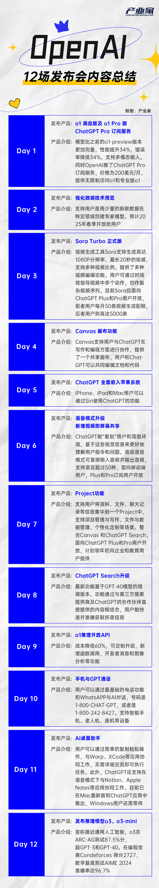
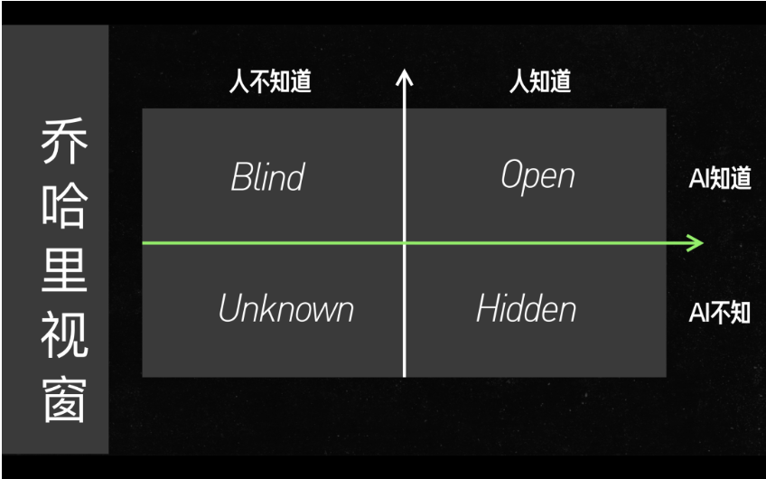
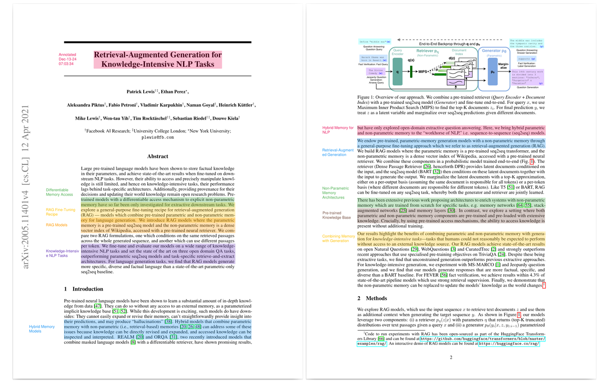

## 一、OpenAI 12 天发布会
时间：2024年12月4日至12月20日
 

## 二、Claude - 《Agent 构建指南》

2 月 20 日，Anthropic 发布一份报告，题目是《Building effective agents》（构建高效的智能代理），原文见 https://www.anthropic.com/engineering/building-effective-agents 。

### 1. 工作流和智能体
**AI 工作流 (AI Workflows) 和智能体 (AI Agents) 是基于系统设计理念的区分，关键在于在系统中分配控制权。**
- **工作流**是通过预定义的代码路径来编排 LLM 和工具的系统。  
  一条规划好的铁轨，当任务非常明确，而且可以分解成一系列固定的步骤时，就像流水线上的工作一样，用“工作流”就足够了。
- **智能体**是由 LLM 动态指导自身流程和工具使用的系统，能够自主控制任务完成的方式。  
  像是一个能够自主导航的系统，当任务需要很大的灵活性，而且需要模型自己做决策时，就像一个需要随机应变的指挥官，这时候“智能体”就更适合。

### 2. 构建方法
**回归 LLM API 本质**  
> **LangGraph（LangChain 的工具）**：就像一套功能强大的乐高套件，可以用来搭建各种复杂的 Agent 系统。  
> **Amazon Bedrock 的 AI Agent 框架**：就像一个专业的工具箱，提供了各种构建 Agent 系统的工具和组件。  
> **Rivet（拖放式 GUI LLM 工作流构建器）**：就像一个可视化编辑器，可以通过拖拽的方式来构建 LLM 的工作流程，非常方便。  
> **Vellum（复杂工作流的构建和测试工具）**：就像一个高级的实验室，可以用来构建和测试复杂的工作流程。  

这些工具简化了 LLM 调用、工具定义等基础任务，但是同时也引入额外的抽象层，这可能会模糊底层的提示和响应，从而使调试更加困难。直接调用大语言模型的 API。

### 3. 构建技巧
**Less is More**
- 优先使用基础构建块：增强型 LLM > 工作流模式 > 自主 Agent。
- 工作流模式包括：提示链、路由、并行化、协调者 - 工作者模式、评估器 - 优化器模式、评估器 - 优化器。
- 构建有效智能体的三个核心原则：**简单、透明、精心设计**
  - 保持设计的简洁性：避免过度复杂化。
  - 优先考虑透明度：明确展示智能体的规划步骤。
  - 精心设计智能体 - 计算机接口 (ACI)：通过完善的工具文档和测试。

 

- **在人类知道和 AI 知道的 Open 这个象限中，我们只需要简单去说，效果会很好。**「你是一个哲学家，请给我解释……」就够了。千万不要展开，展开之后效果会变差。  

- **对于人类知道、AI 不知道的地方，我们应该展开说，把知道的信息、背景、味道、结构放进去，效果就会变好。** 这个地方千万不要吝啬，别简单一说「我们公司起了个东西，两个字进去了」，他是不知道的，那是无效信息。
- **启发：主动学习（标注边界上的，不太掌握的，来修正）。**

## 三、本月高性能大模型推荐

- **Google Gemini**
https://gemini.google.com/app
  - **Gemini 2.0 Flash** ⭐⭐⭐⭐
  - **gemini-2.0-flash-thinking** ⭐⭐⭐⭐⭐
  - **gemini-exp-1206** ⭐⭐⭐⭐⭐

- **国产——DeepSeek**
https://chat.deepseek.com/

- **网络搜索——Perplexity**
https://www.perplexity.ai

- **OpenAI & Claude**

## 四、论文自动标注

https://github.com/neuml/annotateai —— 使用LLMs自动注释论文。  
虽然LLMs能够总结论文、搜索论文并生成关于论文的总结，但本项目专注于在人类读者阅读时为他们提供上下文。
 