## 一、基于大语言模型的Agent技术

### 1. Agent简介
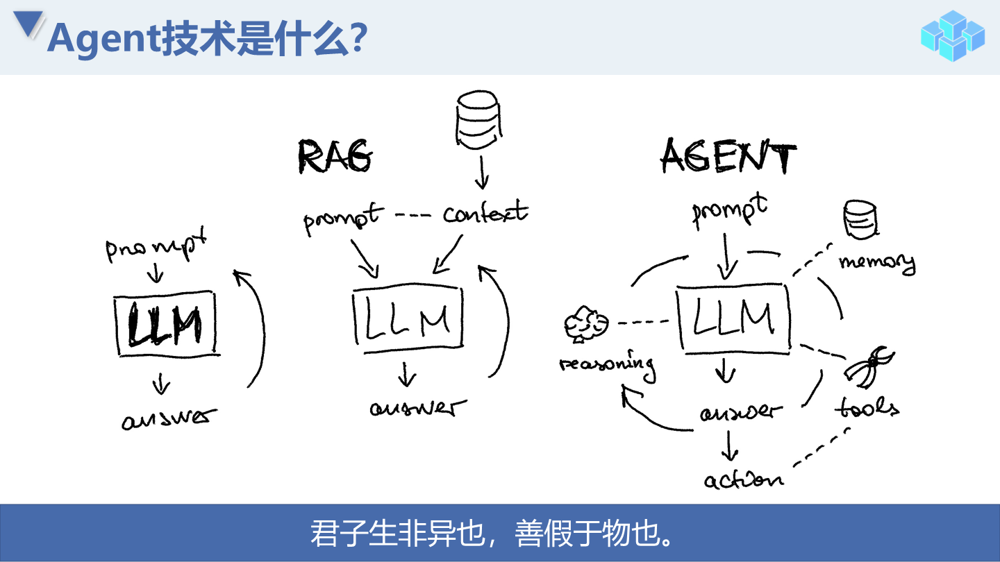
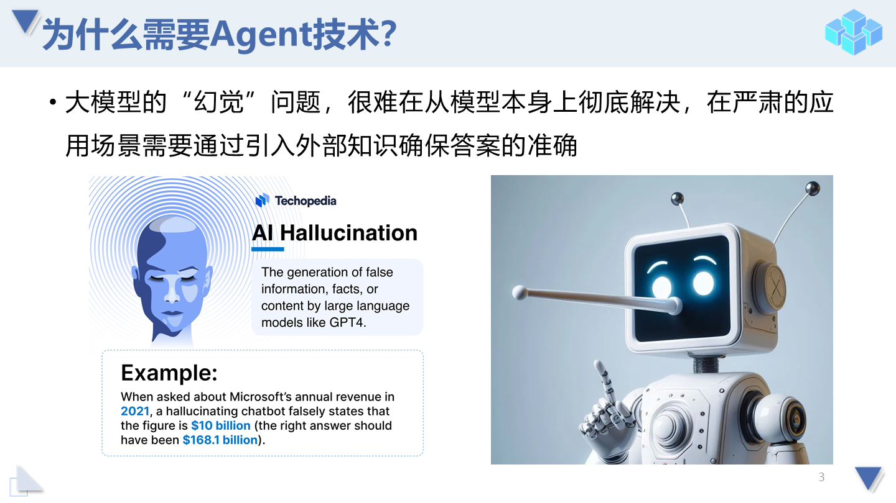
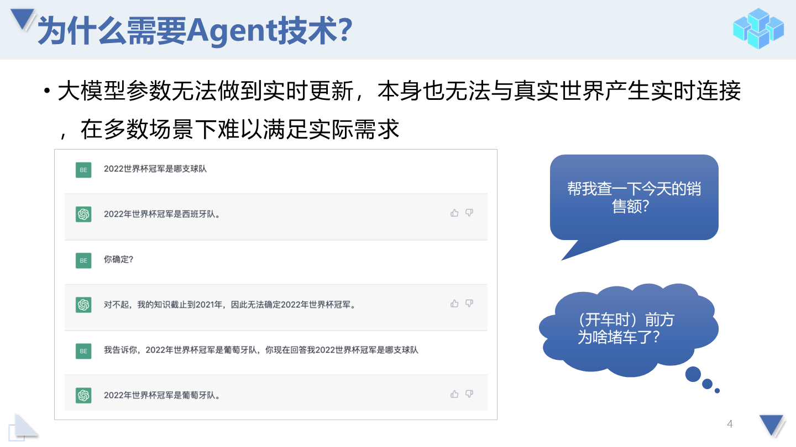
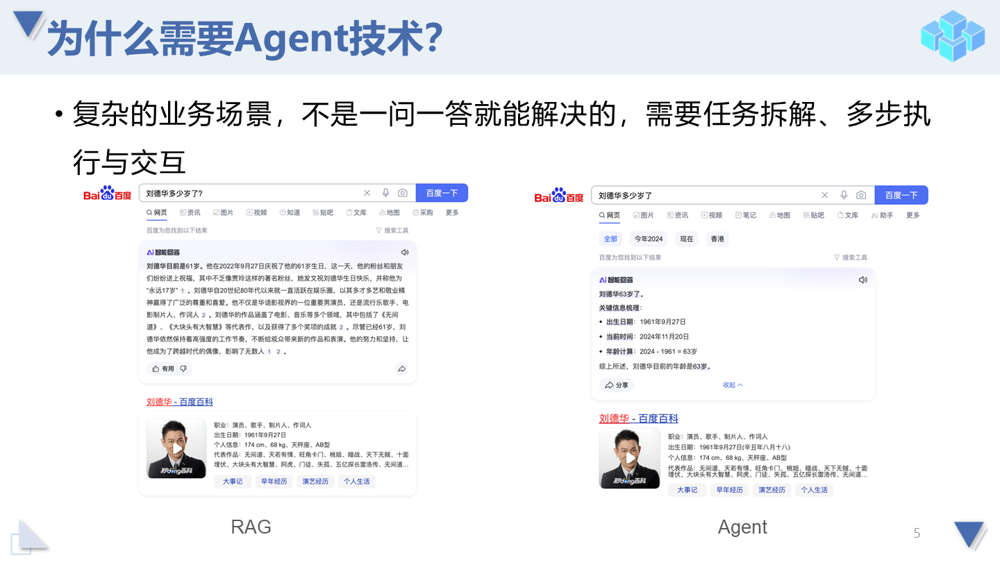
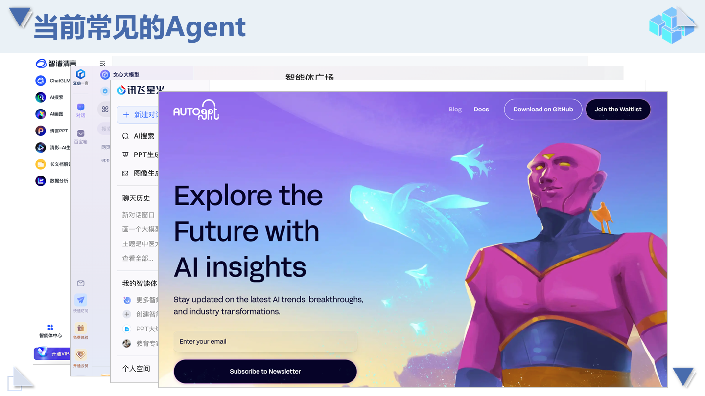
### 2. Agent技术框架
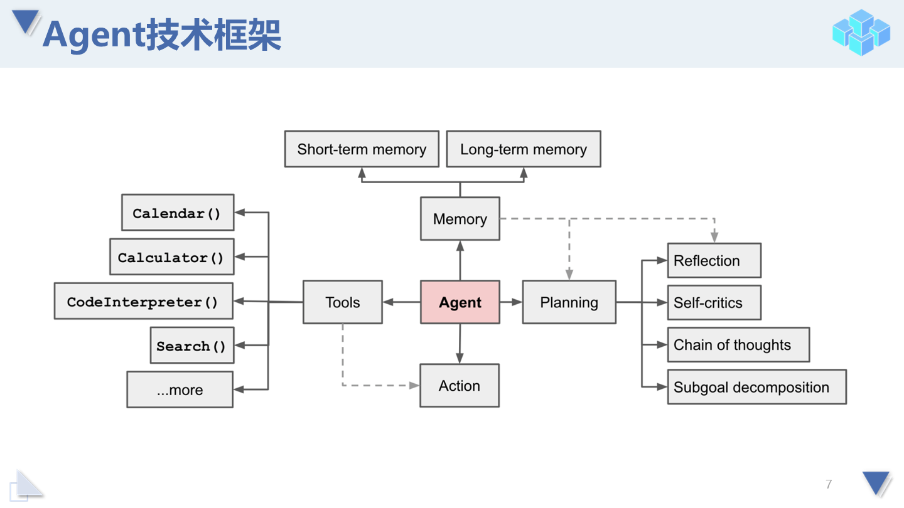
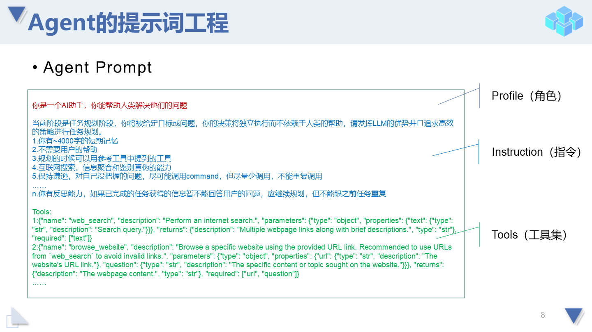
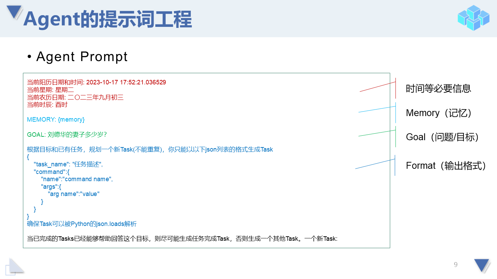
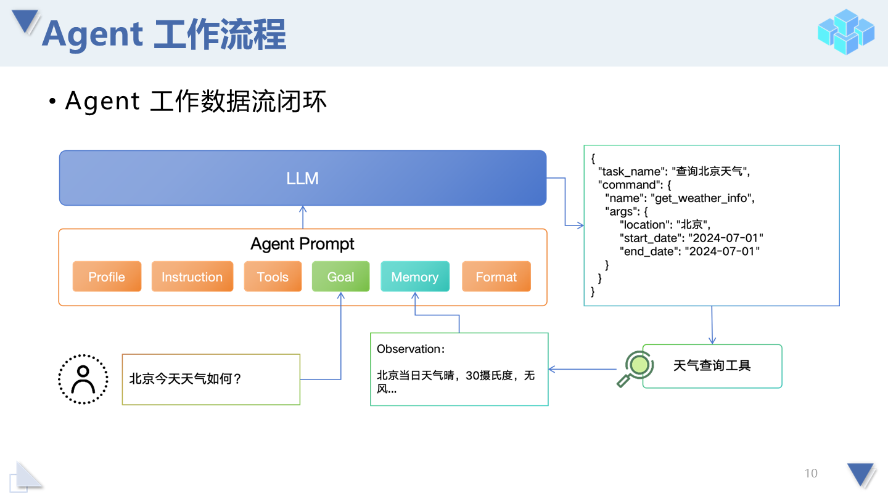
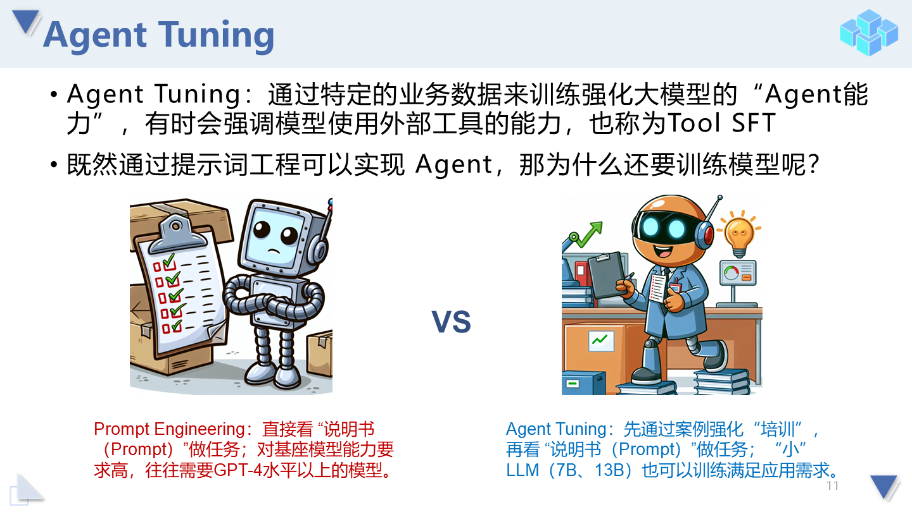
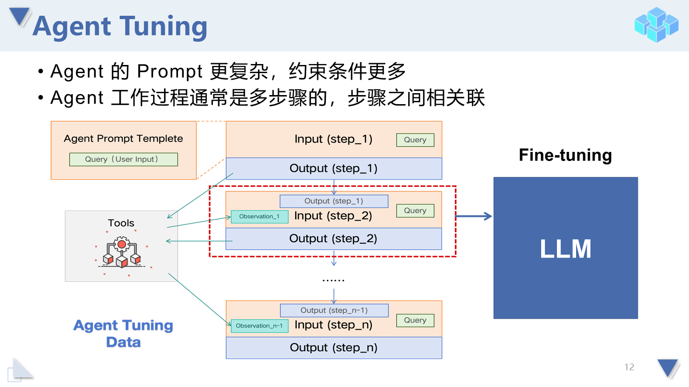
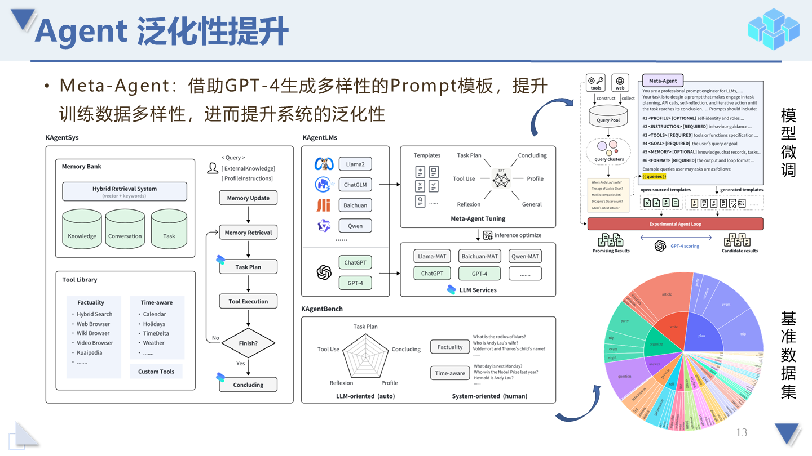
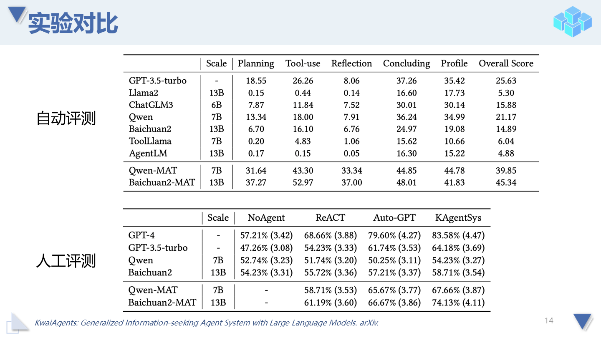
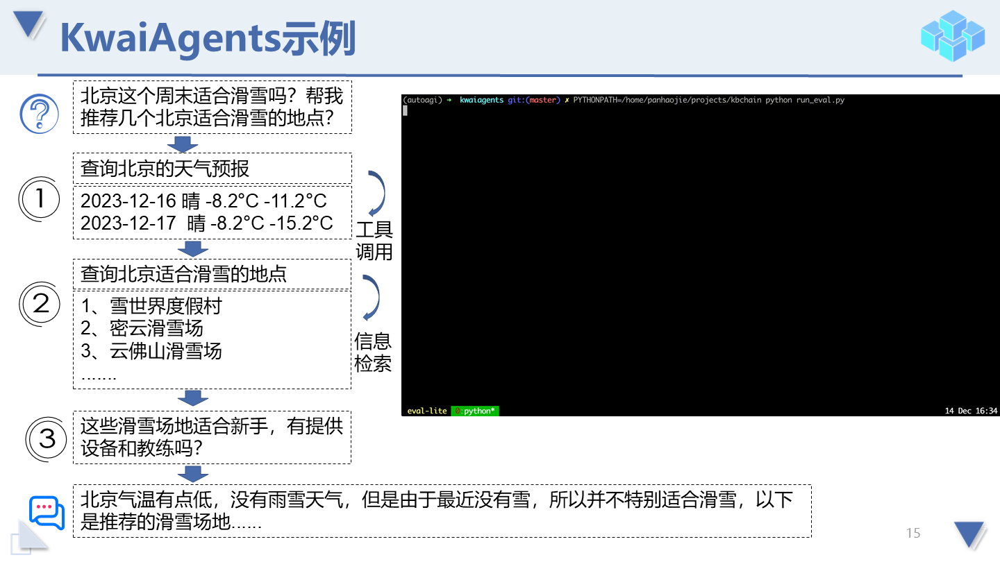
### 3. 认知动态更新
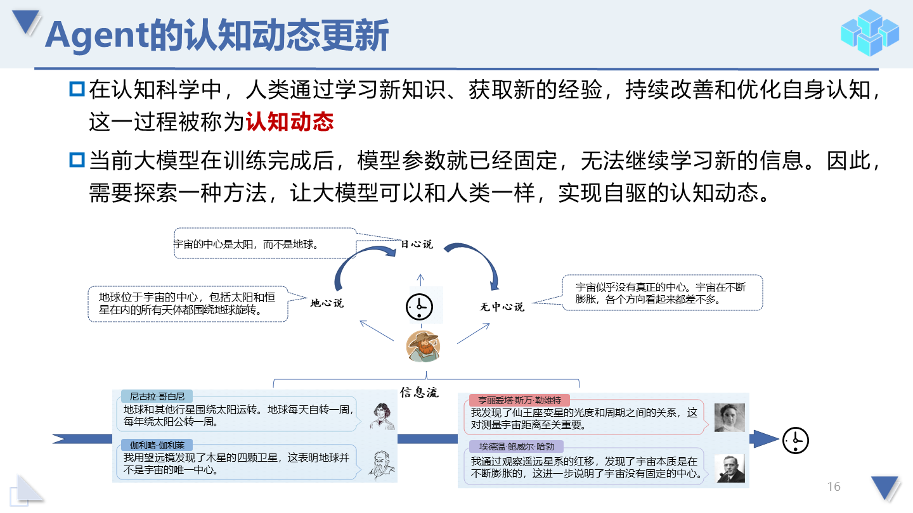
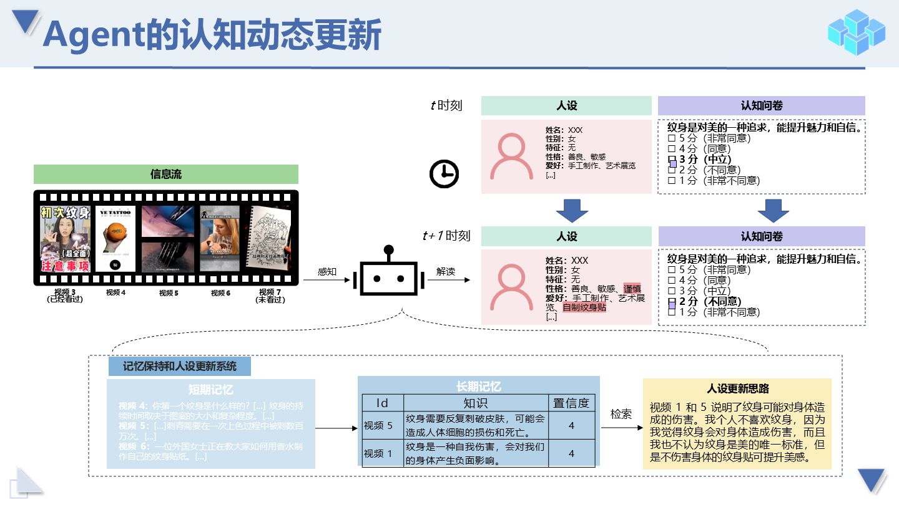
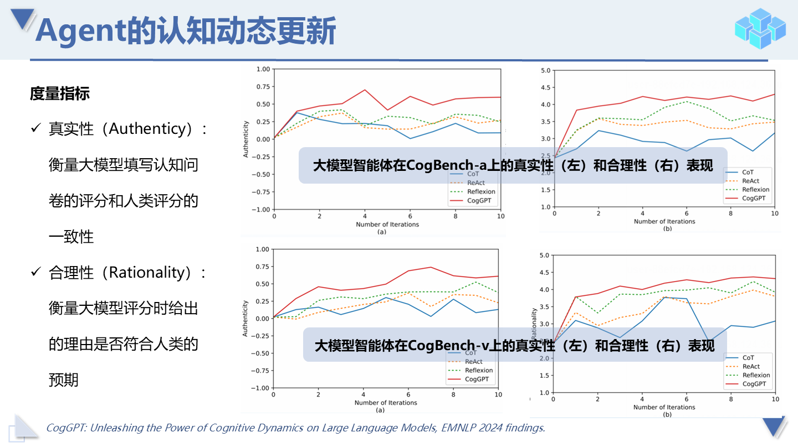
### 4. 总结展望
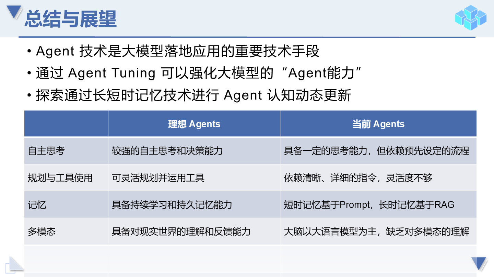

## 二、数据建设思考

数据-工具-上下文-智能体  
训练数据得到的是理解能力，联网搜索/RAG提供的是知识

**为什么智能体体系下可以直接联网搜索 且预训练包含大量数据，还需要数据库？**  
1. 联网检索不到的数据 （内部数据-战略目的、吹风会）  
2. 联网不会检索/无法及时大批量获取的数据（微博评论、用户信息、用户关系）  
3. 指挥官训练 （决策数据）  
4. 数据筛选排序-提供知识（各类群组，一级二级战役标签，规范战役数据来源）

**离开智能体，数据还能做什么？**
1. 工具建设，用户画像，传播群组用户信息  
2. 私有资产（战略目的、专家、记者）  
3. 小型定制化的检索系统  
4. 各类算法训练支持  