## 上期补充：NewsWhip新闻鞭公司
**可借鉴学习的点：**
1. 上层和舆论场的对齐
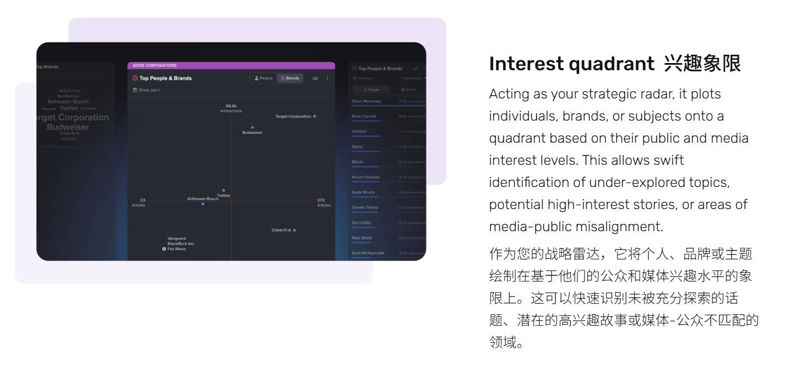

2. 新闻发酵预测（效果评估跨平台/时间对齐、发文预测）、摘要警报
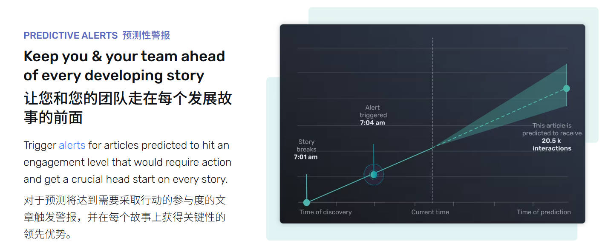

3. 自动高亮

## 一、复杂网络分析

> 复杂网络 ≠ 传播网络！推荐系统、电阻网络、图神经网络、路径规划、拓扑学、聚类算法  
> 传播网络是一个应用场景，不是一定用户是节点、转发是边，也不一定相信gephi一键出来的群组  
> 参考资料：[罗盘复杂网络计算平台](https://www.scicompass.com/method_ground/index)  
> 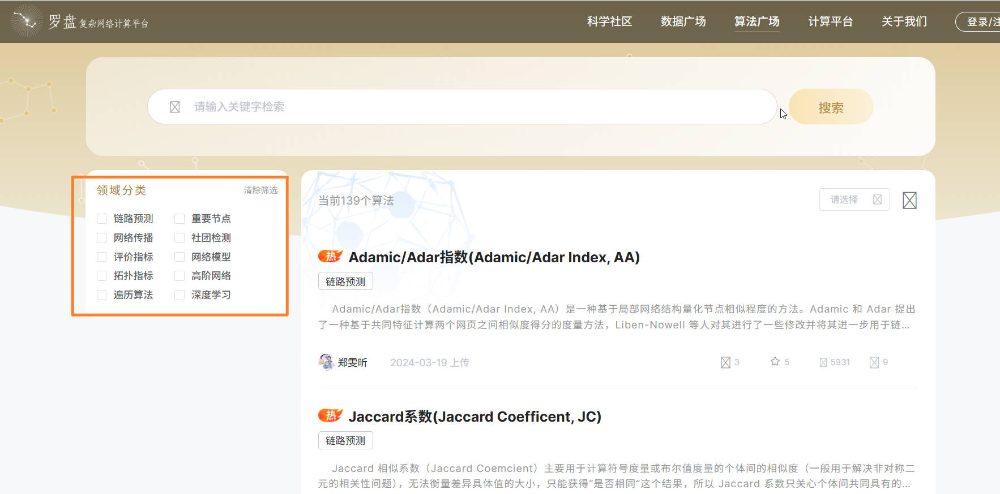

**辐射中心性**  
- **基准中心性算法**：度中心性、接近中心性、介数中心性、信息中心性、特征向量中心性、PageRank算法、引力中心性、自然连通中心性  
- **应用大气辐射物理学中衰减和散射理论的跨学科知识来识别网络中有影响力的节点**  
  - 被评估的节点被概念化为光源，类似于太阳，而网络中的其余节点被视为地球表面的植物，它们是这种辐射的最终接收者；探索每个植物（目标节点）和光源（原点节点）之间的最短路径，沿这些路径的中间节点被暂时视为具有吸收和散射特性的颗粒物（如气溶胶或云滴）。  
  - 局部影响的程度由光源的光度控制，最短路径的长度决定吸收效应的程度，节点处的散射效应会影响向该节点的信息传输的变化。  
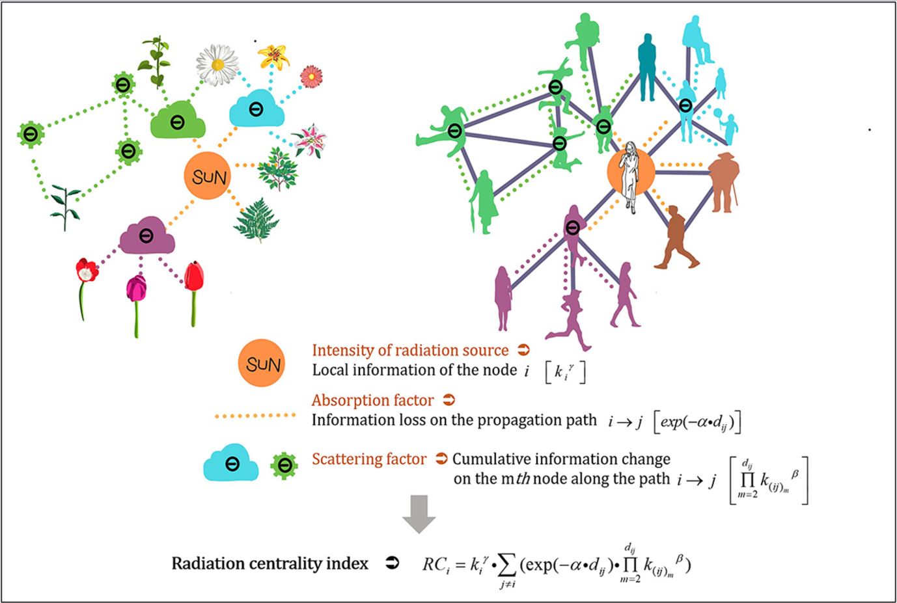

## 二、大模型发展趋势

### 1. 推理能力：数学、代码、逻辑

**近期国产大模型**
- kimi：k0-math  
- 昆仑万维：Skywork o1  
- Deepseek：R1-Lite  
- 阿里：QwQ  

个人推测：近期国产大模型企业推出的模型，也都是更重视**后训练**步骤，推出类似OpenAI o1的模型，重视逻辑推理能力，尤其在数学、编程领域。有意思的是，几个月前国内关于大模型预训练已经到达瓶颈、独角兽企业放弃预训练等消息频频传出，后训练可能是一个行业发展方向。

### 2. 智能体协同  

[《Claude化身服务器联通一切！AI写好代码自己发Github，人类程序员只配动嘴了》](https://mp.weixin.qq.com/s/UXb0KyDCSHkUS_4dCGlsfQ)  
此前：Claude Computer Use  
insight：简单规则与规范->复杂工作执行能力  

**通信协议MCP （Model Context Protocol）**  
> MCP协议就像AI系统与数据源之间的一座桥梁，允许开发者在数据源和AI工具之间建立双向连接  
MCP通过中介（MCP 服务器）和适配器模块，把不同的数据源（无论是文件系统、数据库、API 等）统一到一个标准化的协议层（MCP），从而简化了数据访问、减少了开发成本，并提供了更灵活的扩展能力。
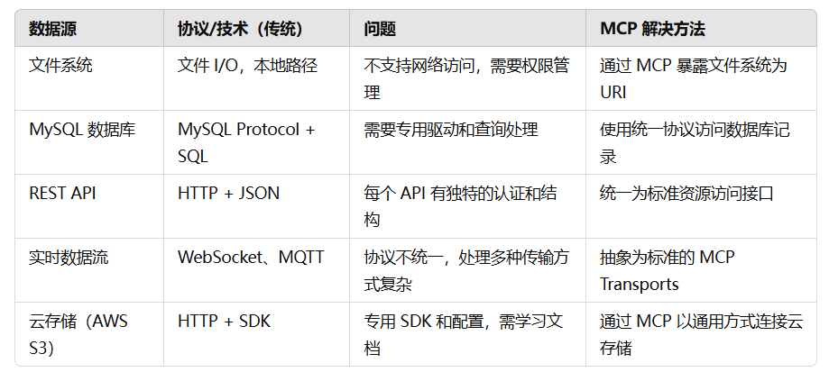

- 每种数据源（例如文件系统、数据库、Web API 等）都通过适配器（Adapter）与 MCP 协议进行集成。适配器将底层的操作转换为 MCP 标准的数据请求和响应。  
- 例如，如果客户端请求访问一个文件，文件适配器会通过本地文件系统读取文件内容并将其转换为 MCP 协议要求的格式返回；如果是访问数据库，数据库适配器会执行 SQL 查询并将结果返回。  
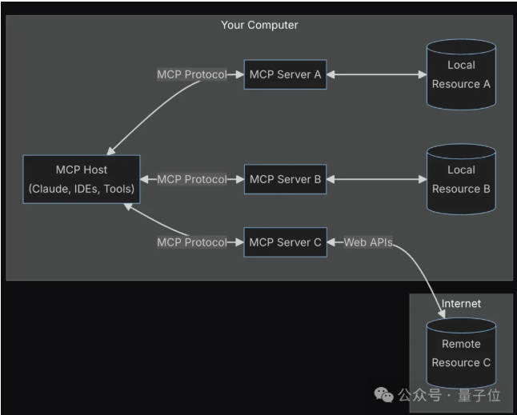

### 3. 空间智能应用开始出现
[李飞飞：AI靠单图生成3D世界，可探索，遵循基本物理几何规则](https://mp.weixin.qq.com/s/iU_XQdF-r8AnnXr2dwI89w)  
[Vidu：体验完Vidu划时代的新功能，我觉得可以正式抛弃3D渲染了](https://mp.weixin.qq.com/s/SlWiaBKK5Qw1hI_7D11TvA)  
[谷歌：谷歌邀马斯克联手做AI游戏！DeepMind版Sora是个3D游戏引擎，一张图生成无限可交互世界](https://mp.weixin.qq.com/s/w7IPR3M5QUGFGsx_I3cxVg)  

### 4. 张钹院士专访（推理能力+多模特对齐+主动做事）
[《甲小姐对话张钹：中国大模型的死与生｜甲子光年》](https://mp.weixin.qq.com/s/v_R2EYPnrlLQzwSXqIpN7w)  

- 推理能力提高（o1类）、多智能体协同是下一个里程碑事件
  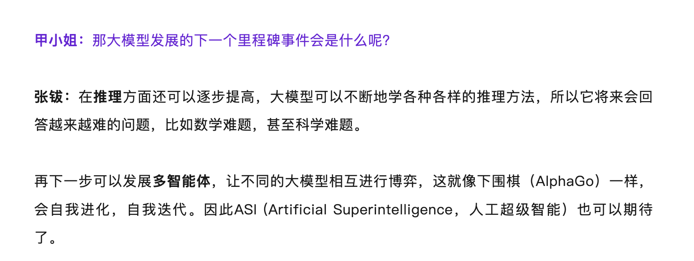
- 多模态对齐到文本做分析是一个比较好的思路，语言的边界就是思维的边界  
  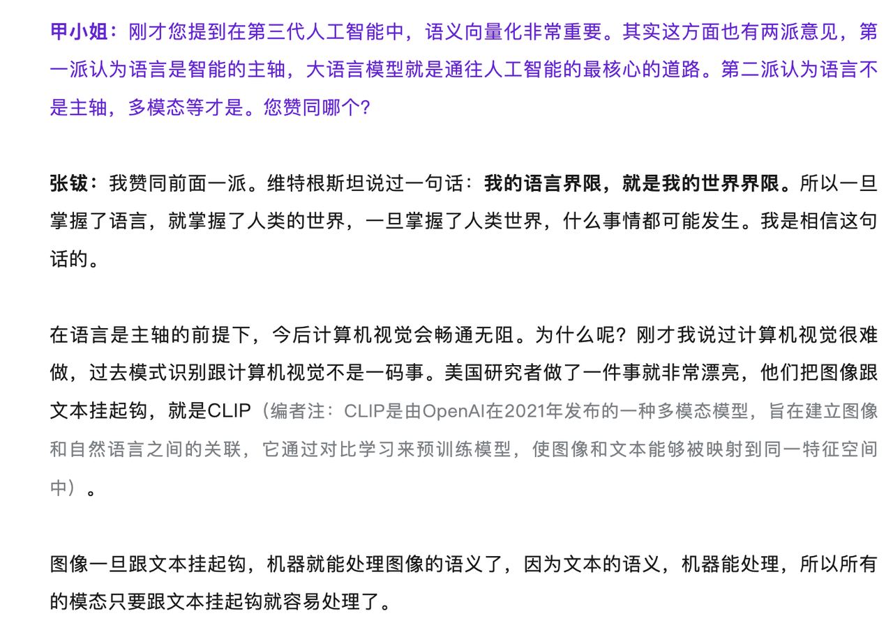
- 智能体主动做事  
  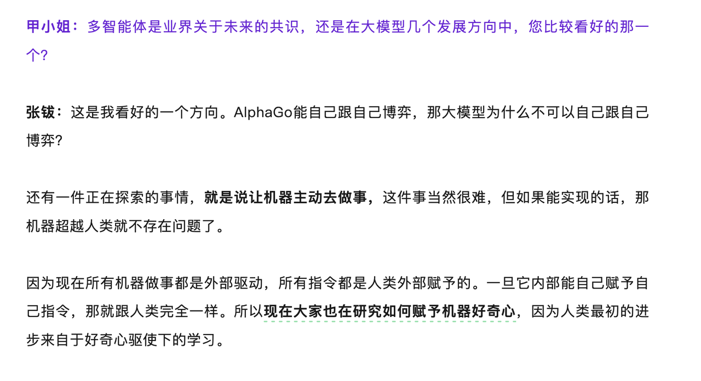

---

## 三、欧盟虚假信息数据库 EU vs Disinfo
[EU vs Disinfo 数据库](https://euvsdisinfo.eu/)  

### 1. 介绍
- **主要研究对象/关心的议题**：欧洲选举、俄乌战争、摩尔多瓦、白俄罗斯、格鲁尼亚、中国、非洲、东部合作伙伴、新冠病毒、欧洲对外行动署特别报告等。
  - 重点关注俄乌战争，其次关注东欧、中国和热点大事件。
  - 近期对非洲的关注上升，认为俄罗斯近两年来在煽动对非信息宣传，利用非洲青年人对当地社会经济困境的失望接受克里姆林宫的反西方宣传。

### 2. 提供的产品
**产品一：案例数据库（共18087条）**  
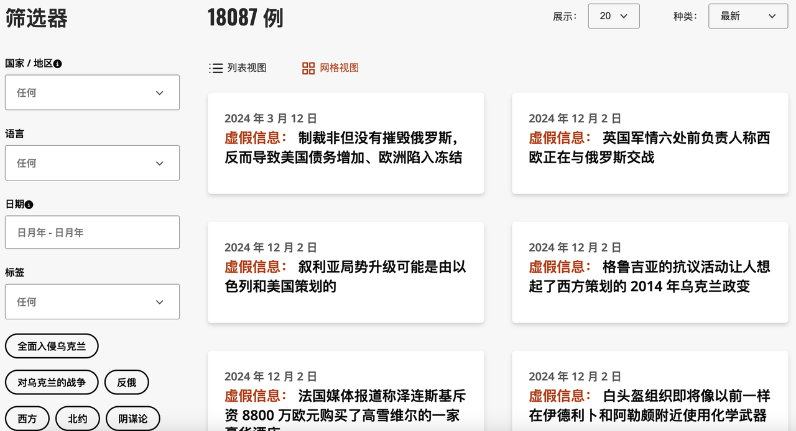  
- 该数据库每周更新一次，仅提供英文版。  
- 所收录虚假信息案例的时间范围：2015年1月至今。  
- 过去一周更新了29条（11.25-12.01）。  
- 数据库筛选方式：可按照【虚假信息涉及的国家和地区】、【时间先后顺序】、【时间范围】、【标签】等进行事件筛选。  
- 主要类别/标签有：俄乌战争；西方；北约；阴谋论；主权；纳粹/法西斯；破坏俄罗斯稳定；军队；弗拉基米尔·泽连斯基；美国总统选举等。  
- 具体内容主要包括【虚假信息内容概括】以及【回应/辟谣】两方面。  此外，还会简要列举虚假信息的【来源】、【发布日期】、【所用语言】、【涉及的国家/地区】、【标签】、【相关案例】等6部分辅助内容。  
- 示例  
  - 《虚假信息：制裁非但没有摧毁俄罗斯，反而导致美国债务增加、欧洲陷入冻结》（24.3.12）[链接](https://euvsdisinfo.eu/report/instead-of-crushing-russia-sanctions-led-to-us-debt-and-europes-freezing/)
  - 《虚假信息：美国控制的生物实验室以研究危险感染为幌子开发生物武器》（21.5.17）[链接](https://euvsdisinfo.eu/report/us-controlled-biolabs-develop-biological-weapons-under-the-guise-of-studying-dangerous-infections/)

**产品二：文章**
**a. 短篇分析文章（共235篇）**
- 《俄罗斯采取信息审查制度合理化对乌战争》[链接](https://euvsdisinfo.eu/1000-and-4000-days-of-censorship-in-support-of-russias-war-against-ukraine/)
- 《虚假信息不是土豆：俄罗斯利用信息核查作为伪装》[链接](https://euvsdisinfo.eu/disinformation-is-not-potatoes/)
  - 该文章中提到俄罗斯资助“全球事实核查网络”，开展不可信的事实核查工作。文章指责俄方利用事实核查否认对自己不利的真实情况，从而进行舆论操纵。
  - 俄罗斯资助的非政府组织ANO Dialog成立“国际事实核查协会（GFCN）”的新闻发布于24.11.20日：[链接](https://dialog.info/na-forume-dialog-o-fejkah-2-0-predstavili-koncepciju-mezhdunarodnoj-associacii-po-faktchekingu/)
  - “对话假信息2.0”：一个俄罗斯组织的、致力于解决虚假信息传播问题的国际论坛。

**b. 学术论文**
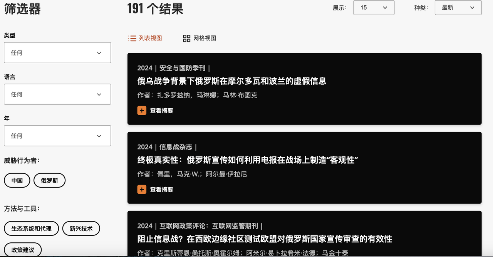

**c. 外部投稿/转载文章**
- 案例一：《中国信息空间中的乌克兰纳粹化》（2022.7.11日）[链接](https://euvsdisinfo.eu/the-nazification-of-ukraine-inthe-chinese-information-space/)  
- 案例二：《中国共产党通过信息行动塑造国际社会对其新疆政权的看法》（2022.9.2日）[链接](https://euvsdisinfo.eu/the-chinese-communist-partys-information-operations-to-shape-international-perception-of-its-regime-in-xinjiang/)  

**d. 虚假信息学习专题**
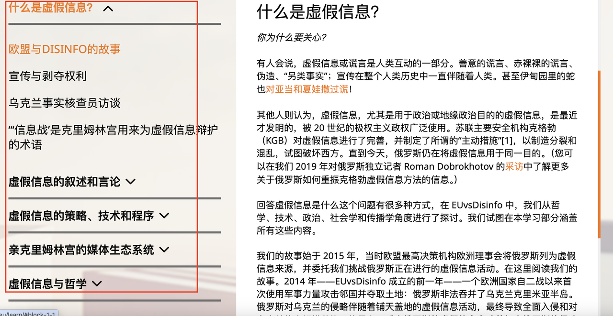  
- 内容全面，涵盖对虚假信息的定义、教导公众应如何理解及应对虚假信息；虚假信息的典型叙述；新媒体上的虚假信息；俄罗斯构建的媒体生态；应对虚假信息的哲学指导等。还给出了一些提高公众对虚假信息辨别能力的工具，例如相关的电影/游戏/博客等。  

**产品三：图表**
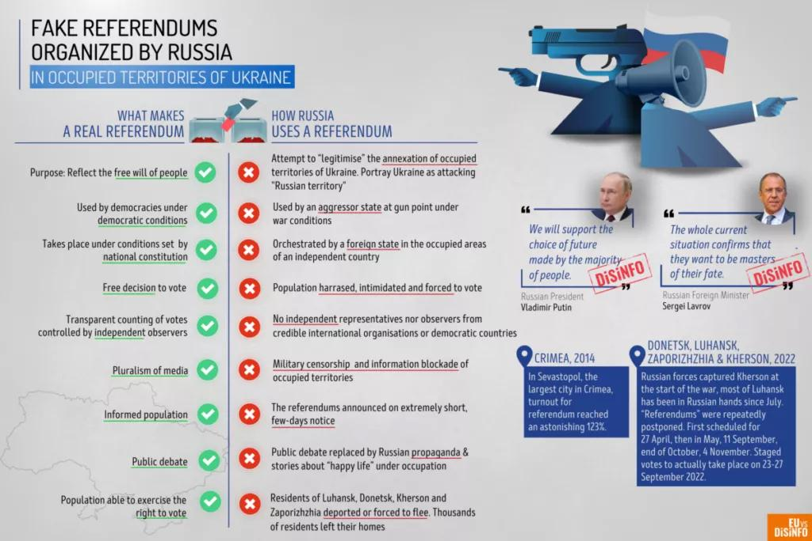  

**产品四：视频（共58条）**
- 类型：科普视频、专家对话等。
- 时长：20秒-15分钟不等。
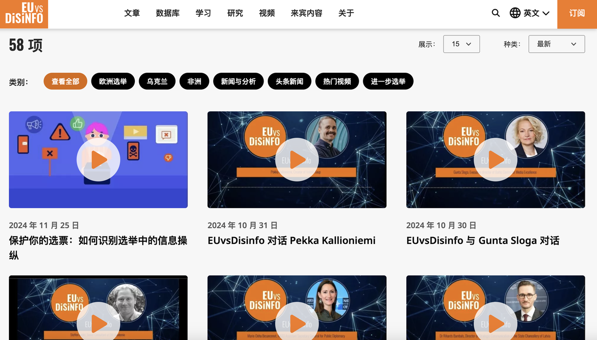 

### 3. 总结
- 绝大部分内容针对俄罗斯。  
- 并非严格的事实核查，而是对虚假信息的澄清和回应。  
- 对虚假信息的收录并不全面。搜索“ghost of kyiv”（基辅幽灵）、“children were rescued”（俄军从乌克兰实验室拯救儿童）等虚假信息均未查询到相关事件。一方面，只收录了俄方散播的虚假信息而没有记录乌方散布的虚假信息。另一方面，对于俄方散布的虚假信息似乎也并不全面（但整体来看整理的很全面）。  
- 立场鲜明，措辞和语言风格并不中立，呈现“一边倒”风格。  

### 4. 用途
- 反向：可用于研究俄罗斯具体采取的认知战措施。
- 教育：其“虚假信息学习专题”中的内容可用于提升公众媒介素养和对于虚假信息的警惕性。
- 数据库用途：EU搭建该数据库后，其图文产品被外媒在写澄清和事实核查时引用，然后再被相关政府部门引用。可以认为，数据库的搭建留存了俄方进行认知战的证据；数据库的日常更新和维护减轻了媒体后续报道时需要做的工作量。
- “欧盟虚假信息数据库”可看作认知战的防守措施之一，这部分的研究未来可以归入这个框架：
  **认知战的攻防措施**
    攻——北约认知作战框架、假旗行动（美国情报外交的新趋势——其中，使用战略解密是方式之一）等……
    防——欧盟虚假信息数据库、事实核查机构等……

### 5. 其他国家/地区的相关产品
来源：https://www.sohu.com/a/531292840_358040  

**俄罗斯**  
网站名称：Объясняем.рф  
网址：https://xn--90aivcdt6dxbc.xn--p1ai/  
网站简介：该网站由俄罗斯政府主导，是一个旨在使公民了解俄罗斯社会经济状况的官方网站，俄乌冲突以来，网站开始对一些不实消息进行辟谣。  

网站名称：Война с Фейками  
网址：https://xn--80aaenqccitej3b1b.xn--p1ai/  
网站简介：该网站是俄罗斯网友建立的非政治倾向的电报频道，针对俄乌冲突专门建立。  

**乌克兰**  
网站名称：Stopfake.org  
网址：https://www.stopfake.org/ru/glavnaya-2/  
网站简介：Stopfake.org由乌克兰公共机构“媒体改革中心”于2014年3月创立，以乌克兰语、俄语、英语、西班牙语、罗马尼亚语、保加利亚语、塞尔维亚语、法语、意大利语、荷兰语、捷克语、德语和波兰语进行检查、编辑、翻译和发布信息。  

**美国**  
网站名称：politifact  
网址：https://www.politifact.com/  
网站简介：politifact是美国具公信力的事实核查网站之一。  

网站名称：factcheck  
网址：https://www.factcheck.org/  
网站简介：factcheck是一家较为著名的美国专注政治领域事实核查的网站。  

网站名称：Snopes  
网址：https://www.snopes.com/  
网站简介：Snopes是美国一家专门核查并揭穿谣言和传闻的网站，由大卫·米克尔森在1994年成立，起初该网站致力于调查都市传说、恶作剧和民间传说。能够通过使用技术手段分析网络图像、视频是否经过数化处理从而判别真伪。  

网站名称：Botometer  
网址：https://botometer.osome.iu.edu/  
网站简介：该网站是美国印第安纳大学OSome的合作项目，主要根据推特用户发布的消息为账户的活动进行打分，自动识别社交机器人。  

**其他国家**  
网站名称：fullfact  
网址：https://fullfact.org/  
网站简介：fullfact是一家英国的综合性事实核查网站，由独立的事实核查员和活动家组成。  

网站名称：euvsdisinfo  
网址：https://euvsdisinfo.eu/  
网站简介：该网站欧盟对外行动服务局东欧战略通信工作组的旗舰项目，成立于2015年，提供英语、法语、俄语、西班牙语、德语等13种语言服务，主要针对俄罗斯的宣传活动开展分析和应对。  

网站名称：EU Disinfo Leb  
网址：https://www.disinfo.eu/ukraine-hub/  
网站简介：EU DisinfoLab是一个独立的非政府组织，总部设在比利时布鲁塞尔，网站致力于持续监控所有社交平台上的虚假信息活动，识别信息趋势和威胁，应对针对欧盟及其成员国、核心机构和核心价值观的虚假信息宣传活动。此外还使用开源情报技术(OSINT)发现虚假信息网络、策略以及仿冒活动。俄乌冲突以来，该网站开设乌克兰冲突中心专栏。  

此外，在[国际事实核查网联盟IFCN签约列表](https://ifcncodeofprinciples.poynter.org/signatories)中，还可以跳转到约150个已签署IFCN准则或正在审核资格的门户网站，这些网站遍及各大洲，包含了几乎所有的主要语种。  
活跃的141个IFCN成员中，并没有来自中国大陆的机构。活跃成员中有一个来自中国香港的[“安妮实验室”](https://annielab.org/about/)，是香港大学新闻与媒体研究中心（香港新闻学院新闻）与在香港注册的非营利性教育组织ANNIE（亚洲新闻和信息教育者网络）合作的一个事实核查项目。  
更新中的34个IFCN成员里有一个来自中国台湾的机构[“我的笔”](https://www.mygopen.com/)，和一个中国香港的[“香港浸会大学事实核查”](https://factcheck.hkbu.edu.hk/)。