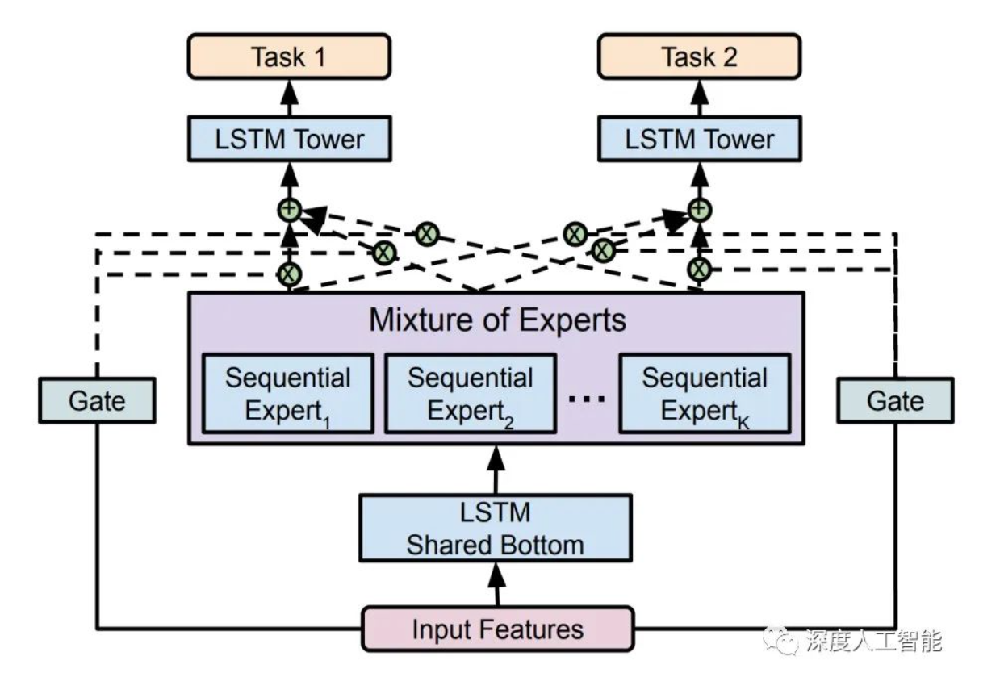
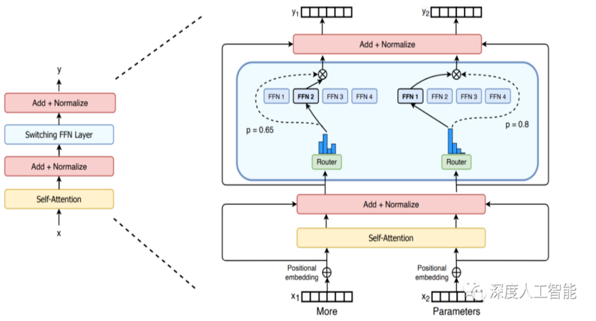
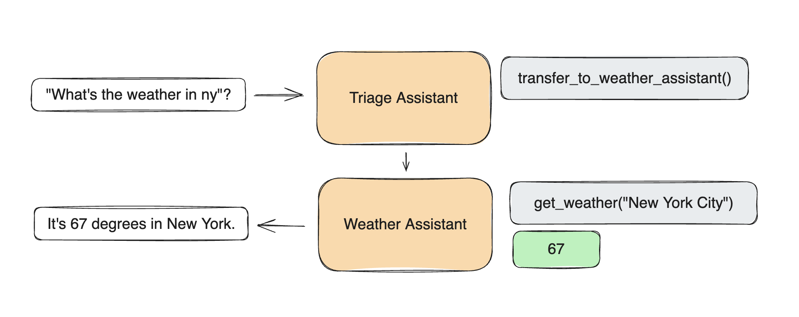
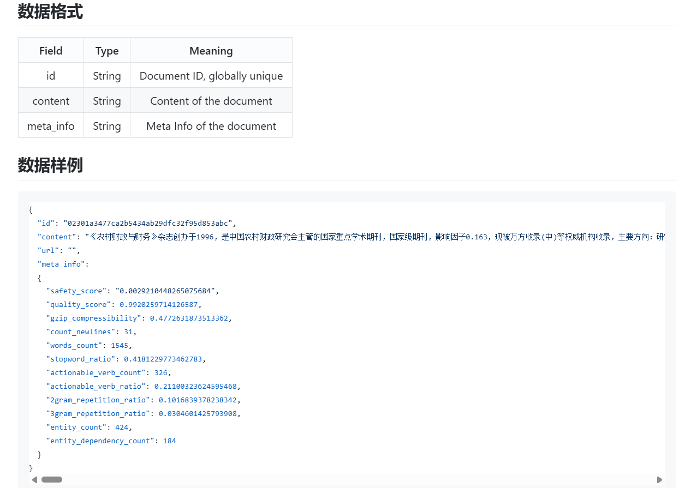
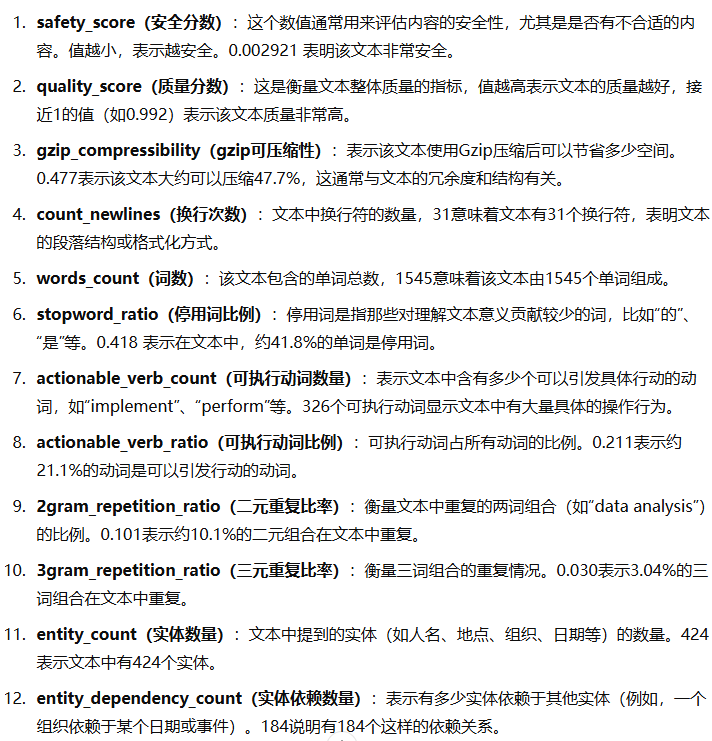
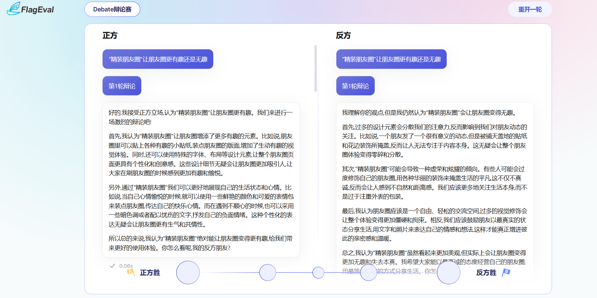
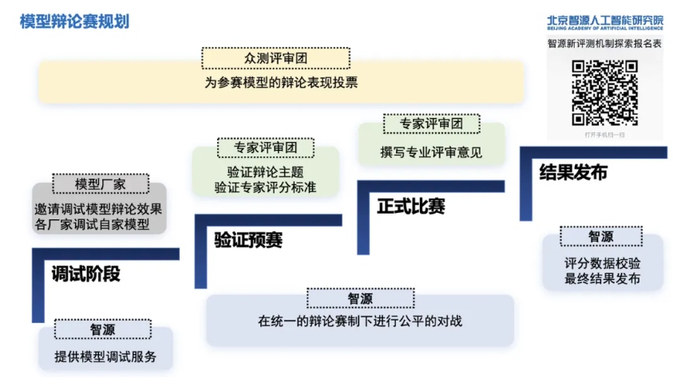
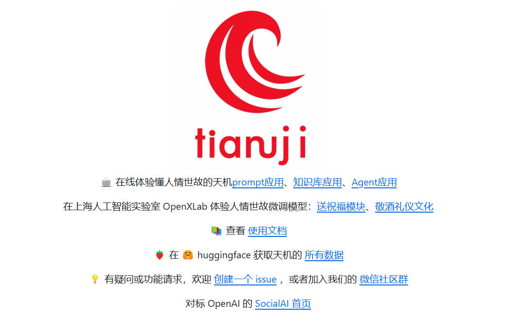
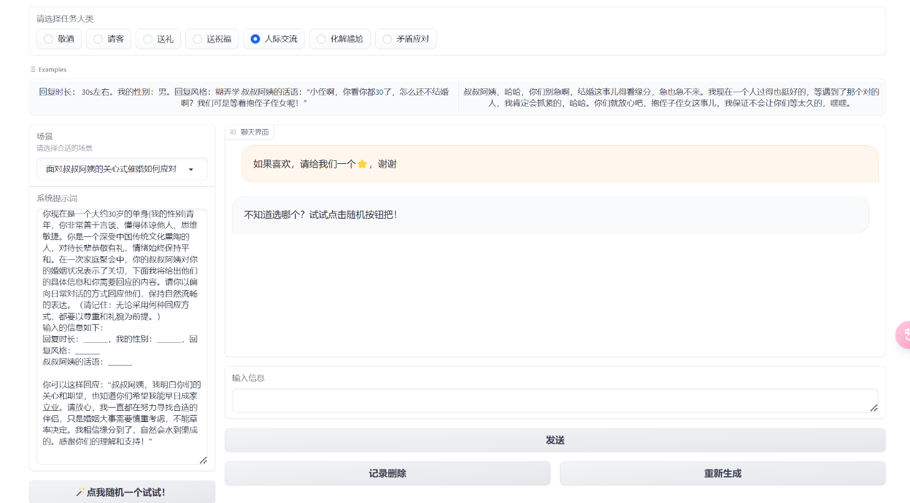

## 一、MOE混合专家模型
### 1. 混元Large模型
2024年11月5日，腾讯再次开源了最新的MoE模型 Hunyuan-Large（混元Large），一个至今全行业公开发布出来的**最大参数的MoE架构**的模型。  

另外讨论一个观点：腾讯的方法是在天然文本语料库的基础上，利用混元内部系列大语言模型构建大量的高质量、多样性、高难度**合成数据**，并通过模型驱动的自动化方法评价、筛选和持续维护数据质量，形成一条完整数据采集、筛选、优化、质检和合成的自动化数据链路。目前，它在数学和代码领域获得了超过 10% 的提升。

### 2. MOE 是什么

一个门控网络和若干专家网络。   
- **训练阶段**：
  - **若干专家网络**：包含初始参数的模型架构，训练得到每个专家一组单独的参数。
  - **门控网络**：不需要非常复杂的结构，使用同样的训练数据。
- **推理阶段**：
  - 根据输入数据动态选择并加权激活的专家。

2017年，谷歌首次将MoE引入自然语言处理领域，通过在LSTM层之间增加MoE实现了机器翻译方面的性能提升。  
  

2020年，Gshard首次将MoE技术引入Transformer架构中。  
  

### 3. MOE和多智能体的区别
完全不同的概念。  
多智能体系统是由多个自主智能体（Agents）组成的系统；MoE是一种机器学习模型架构。  
多智能体可以 有中心化协调器 或 去中心化协作机制。

**多智能体框架**
- [超轻量级agent框架swarm](https://github.com/openai/swarm)：角色（包含流程）+工具  
- [CrewAI](https://www.crewai.com/)
  

**多智能体应用**
MAIC 大模型驱动的多智能体协作自适应课堂框架  
  

## 二、语料积累方法

### 1. 智源中文互联网语料库 CCI3.0
2024年4月，智源发布1000GB 的数据集以及 498GB 的高质量子集 CCI3.0-HQ，2023年11月曾首次开源 CCI 1.0。  

  

**数据处理规则**包括：
- 基于规则的过滤：基于关键词的安全过滤、垃圾信息过滤等。
- 基于模型的过滤：通过训练分类模型过滤低质量内容。
- 去重：在数据集内及数据集之间进行去重。

> CCI 3.0 下载地址
> Flopsera：[数据汇聚运营管理平台](http://open.flopsera.com/flopsera-open/data-details/BAAI-CCI3)
> Huggingface：[BAAI/CCI3-Data · Datasets at Hugging Face](https://huggingface.co/datasets/BAAI/CCI3-Data)
> Datahub：[Data Hub](https://data.baai.ac.cn/details/BAAI-CCI3)

**数据集特点**
- **规模扩大，来源广泛**：CCI 3.0收录超过2.68亿个网页，涵盖新闻、社交媒体、博客等多个领域。CCI 3.0的数据规模相较于CCI 2.0扩大近一倍，数据来源机构扩展至20多家，显著提升数据覆盖面和代表性。  
- **精细标注，赋能应用**：CCI 3.0对原始数据进行了覆盖语法、句法、教育程度等**10多个维度**的细粒度分类和详细标记，以筛选高价值数据，为企业定制个性化训练数据提供可能性。此外，CCI 3.0 HQ是基于70B模型自动标注样本，然后训练小尺寸质量模型进行优中选优得到的高质量子集，可更好地满足不同行业和应用场景的需求。  
- **效果显著，更懂中文**：同一500M模型基于不同的数据集从零开始训练100B数据对比实验表明，CCI 3.0在单独中文语料训练和中英文语料混合训练的效果上优于其他数据集，而CCI 3.0 HQ的效果更加突出。

 

### 2. 辩论数据集

智源发布 FlagEval Debate 全球首个中文大模型辩论平台。  
- 通过引入模型辩论这一竞争机制对**大语言模型能力评估**提供新的度量标尺。
- 收集数据，不能输入辩论选题。
- FlagEval Debate 官网：[Flageval大模型角斗场](https://flageval.baai.org/#/debate)
- 开放性众测观众报名链接：[智源新评测机制探索报名表](https://jwolpxeehx.feishu.cn/share/base/form/shrcnanu35NqOKaefVMUJKv6JYg)

 

 

## 三、领域大模型研发

代表项目：[人情世故大模型]((https://github.com/SocialAI-tianji/Tianji?tab=readme-ov-file))

 
 

## 四、 Recaft 海报生成
https://www.recraft.ai

特点：自由画布，可用于做讽刺漫画，海报策略（同期，chatgpt更新画布功能）

 
 

