## 一、SMP2024分享
全国社会媒体处理大会（SMP）专注于以社会媒体处理为主题的科学研究与工程开发， 今年的主题是**大模型时代的AI+**。

### 1. 大模型测评
**趋势**：从 任务导向（单点评分）到 能力导向（指令遵循、智能体能力等）。
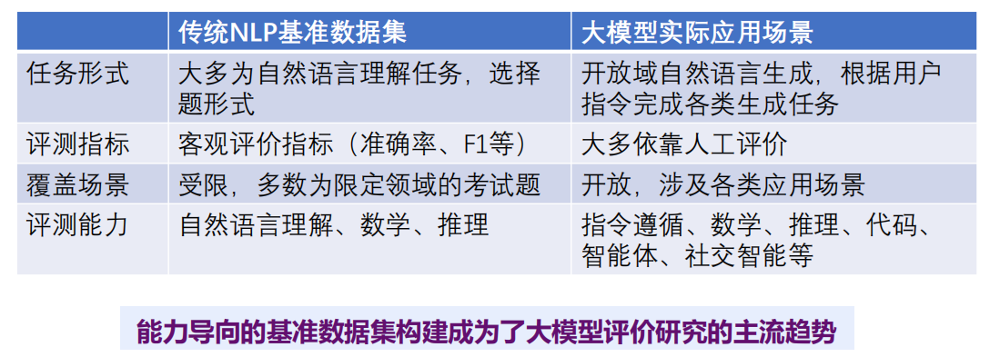   

**具体工作**：数据集、评价模型、评价平台。
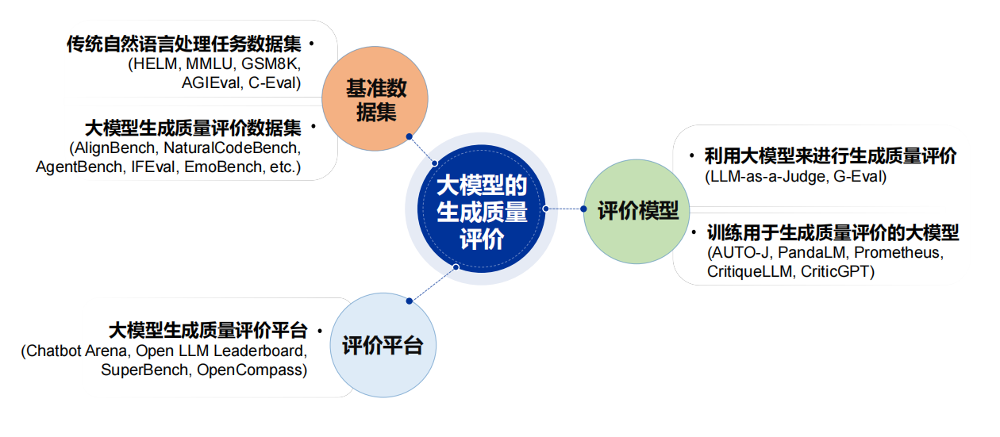 

**对齐任务**：区别 模态对齐 和 训练-评估对齐
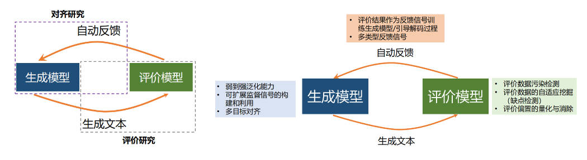 

### 2. 多模态智能体
**定义多模态智能体**：环境（世界模型:生成/预测/知识）-任务-观察空间-操作空间。
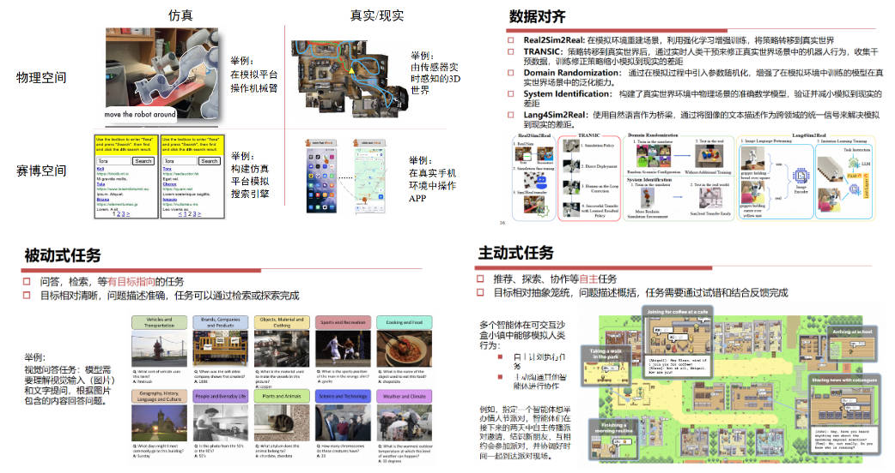 
**构建多模态智能体**：准备数据-选择模型-确定工作方式-确定训练方式。
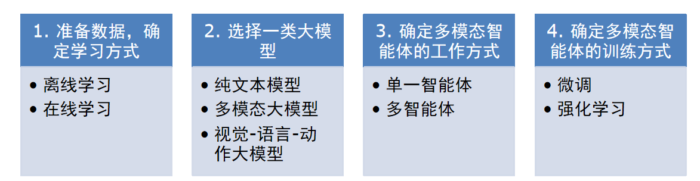 

### 3. 自主智能体/社会仿真
智能体的**反思判断**非常重要且容易忽视，**机制设置**是新兴发展方向，包括反复试错、智群等。
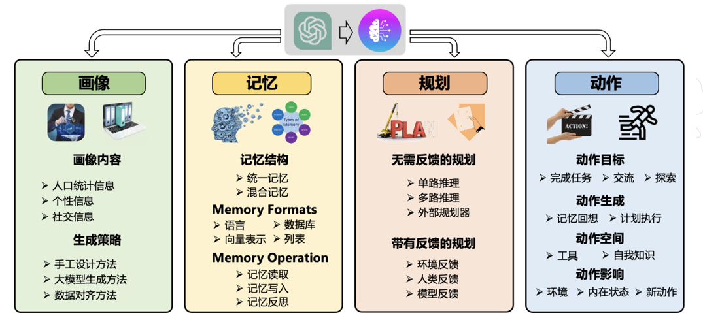 
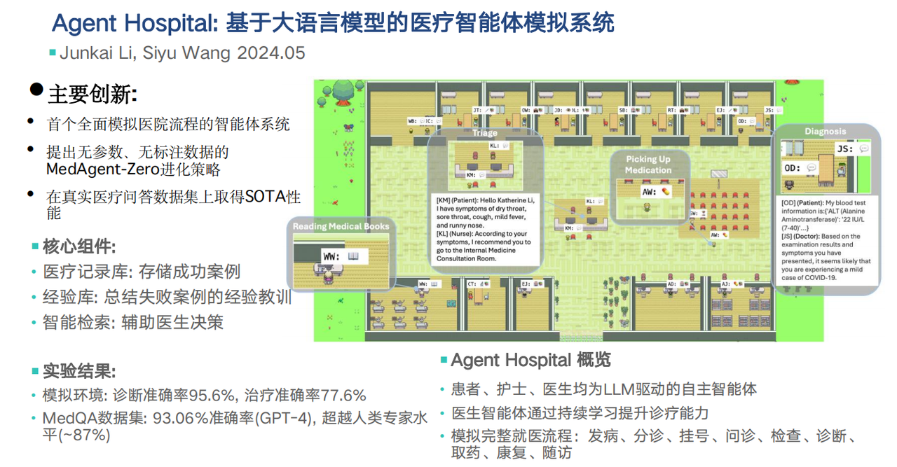 
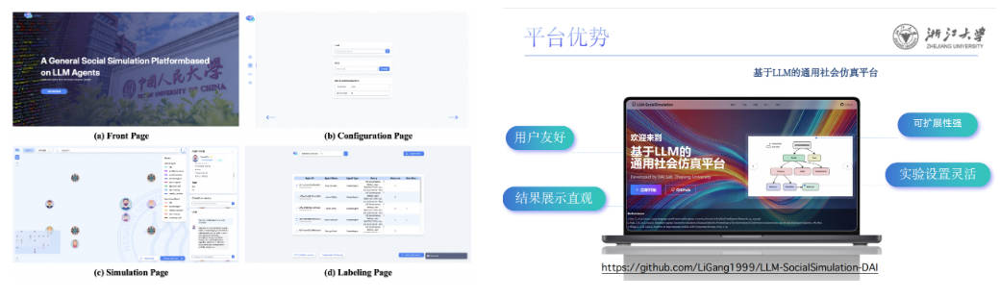 

**参考项目**
https://github.com/TangJiakai/GenSim
https://github.com/LiGang1999/LLM-SocialSimulation-DAI

### 4. 应用
- 研究需要**窄而大**的数据，而不仅是大数据
- 在生成结果后加入**奖励机制**，优化模型生成结果思路
- 利用**多智能**体进行复杂任务分解及工具调用实现**大小模型协同**决策
- 合理利用智能体的**自主意识**（灵活性、创意）

**（1）基于Multi-Agent 的金融场景大模型及其应用**
报告人：王磊 （平安科技前沿技术部门负责人）
- 主要介绍了**平安科技**在销售营销、客户运营、风控审核、员工辅助四个板块内大模型的介入与赋能，针对场景共开发300+应用。  
- 首批尝试以减少人力为主，大模型介入在客服转人工、人工出单等方面省去了70%的人力。  
- 大模型难以直接解决复杂的金融问题，需要有**垂直领域工具**的支持，主要分为四个板块：  
  - 分析--风险、热点舆情  
  - 预测预警--异常情况  
  - 检索--数据、文本、关键信息  
  - 决策推演--综合判断  
- **利用多智能体进行复杂任务分解及工具调用实现大小模型协同决策**。
  - 对解决问题的任务进行多层次分解，拆分为多个细小任务，指定细颗粒度解决办法，依次联合处理任务。
  - 这种方法可以使用小模型处理小任务，解决算力等耗资问题。

**（2）模拟环境下的大模型智能体行为研究**  
报告人：王浩（香港科技大学（广州）助理教授）  
- 在游戏（类似狼人杀，游戏场景便于操作，真实社会场景过于复杂不便于模拟）中分析智能体的行为，游戏中有不同的角色，给智能体设定不同的身份，观察智能体在游戏环节中的自我行为意识。  
- 只需要提供简单的prompt：你在玩某某游戏，告知规则，你是某某角色
    - **社会行为评测-积极 团队协作 领导力**  --  分析智能体回复的内容 用GPT分析其积极倾向；
    - **社会行为评测-消极 对抗 欺骗**  --  分析对话内容与实际身份作对照，分析消极倾向。

**在没有特别指示的情况下，智能体在游戏中会有自主的行为意识**，目前在探索如何控制智能体的行为。

**（3）用大模型模拟人们预期的形成**
报告人：陈坚（厦门大学经济学院、邹至庄经济研究院教授）   

《利用ChatGPT提取的积极新闻预测股票市场收益的研究》  
**研究背景和目的**：去年降印花税，但市场没有买账 ，高开低走，今年也是这样，能够看出来预期会影响股价，那投资者是如何对利好或负面信息形成预期，然后反映到股价上。  
**研究内容和发现**：
- 从《华尔街日报》下载了1996年至2022年的标题和摘要，并使用ChatGPT识别股市的好消息和坏消息。  
- 每月都有高比例的好消息预测随后的高市场回报率。这种可预测性将持续到未来六个月，并且对其他提示和微调非常有效。  
- 但大众对利好消息/政策形成的预期具有滞后性，在经济低迷情况下更为明显。  
- 研究结果表明，ChatGPT可以识别人类投资者无法完全捕捉的宏观经济相关利好消息内容，从而导致逐步的市场反应。在经济低迷、EPU高、新颖性高的情况下，这种效应更为明显。  

**启发**：
- 提供了一个看大众如何在看到利好或负面政策后形成预期的方法和视角，并且发现人们对于利好消息的预期形成是有滞后性的，因此可以模拟去分析舆论场对于政策的预期形成。  
- 后续交流后，发现他们也对中国投资者的宏观经济预期进行分析，通过运用大模型去建构和分析中国不同种类的投资者对于宏观经济政策的预期形成。  
- 用大模型做情感分析：情感分析往往被视作一个文本分类问题。早期文献主要通过预定义的情绪词典匹配文本中的特定词汇来识别文本情感类别，该方法因其直观性与可解释性等特点获得学者广泛应用(Loughran & Mcdonald.2011)。随着文本大数据不断累积和人工智能技术的进步，应用机器学习进行情感分析成为主流，**其核心逻辑是通过带有标签的训练数据集来训练机器学习模型，最后将训练模型用于测试集进行情感态度预测**，从而能够更高效的处理复杂的文本分类任务。近年来，自然语言处理和机器学习的快速发展催生了LLMs兴起，为文本分析带来的新视角。这类模型通过在大规模语料库上进行预训练，让模型掌握了丰富的语言知识和强大推理能力，从而能够更精确捕捉到文本内容的深层语义信息。

**（4）认知安全定义和应用场景**
报告人：李晓宇(西北工业大学副研究员)  
- 没有人定义过认知安全，学习了美国建构的认知安全框架，并建构了认知战框架
- 几个研究成果和应用场景
  - 认知标注中文数据集
  - 社交网络中度量认知偏差的体系化方法
  - 新闻内容安全深度审查（低级红高级黑）

### 5. 观点讨论
- gpt o1 或许代表，预训练阶段的发展已经到瓶颈，需要开启**后训练阶段**。
- 可以通过借鉴人类大脑的 反思、推理 工作方式，**把人交互学习能力教会给机器**，直接把认知教会给机器不太现实。
- **原生的多模态大模型**未来可能会实现，目前还基本都是将其他模态对齐到文本模态 （理解原生的多模态大模型是什么）。
- **基于人类反馈的强化学习**是现在的一个研究重点，但也存在很多问题，如闭源模型不好做、评价偏主观、模型偏执（自增强偏执、位置偏执）等。

## 二、智能体调研
### 1. 理论发展现状
- 与独立的LLMs相比，LLM-based agents通过增强LLMs感知和利用外部资源和工具的能力，大大扩展了LLMs的多功能性和专业知识。  
- 目前对于AI agent的研究主要集中在**多Agent系统**（Multi-Agent System）。

**多Agent系统的关键特点**包括：
1. 自主性：每个Agent都能够控制自己的行为和内部状态，并且有能力在没有直接外部干预的情况下作出决策。
2. 交互性：Agent之间可以相互通信和协作，以解决超出单个Agent能力范围的复杂问题。
3. 社会能力：Agent能够理解其他Agent的行为和意图，并在多Agent环境中采取适当的行动。
4. 可扩展性：系统可以通过增加Agent数量或种类来扩展其功能和复杂性。
5. 模块性：系统的设计允许在不干扰其他部分的情况下添加、移除或替换Agent。
6. 灵活性和鲁棒性：多Agent系统能够适应环境变化和代理行为的不确定性，即使某些Agent失败，系统也能继续运行。

**MAS的最新研究**：
- 优化MAS可用性和效率
  - 通过迭代训练提高基于大型语言模型（LLM）的多代理系统（MAS）的通信效率和任务执行效果。  
  - Optima采用生成、排名、选择和训练的迭代范式，通过平衡任务性能、令牌效率和通信可读性的奖励函数来优化MAS。  
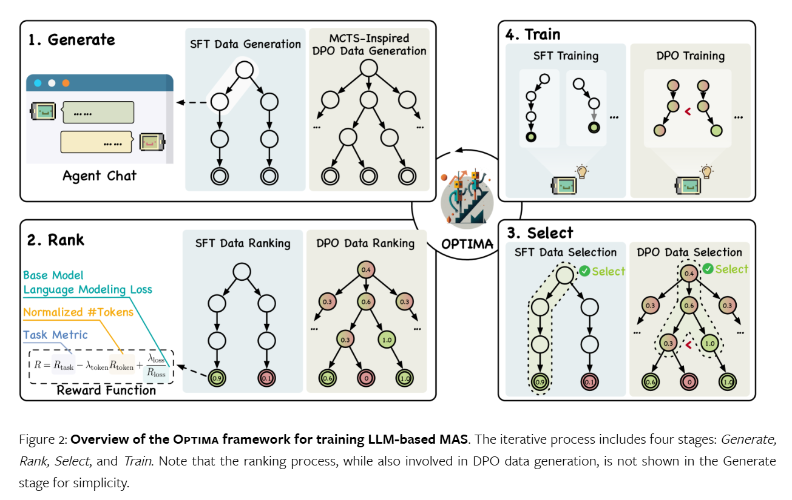 
- 提出利用LLM来增强多个智能体的规划能力
  - 任务分解：通常涉及两个关键步骤：首先是将复杂任务分解（decompose），其次是为子任务进行规划（sub-plan）。  
  - 多计划选择：侧重于引导LLM生成多个备选计划，然后使用任务相关的搜索算法选择一个计划执行。这个过程包括多计划生成和最优计划选择两个主要步骤。  
  - 外部规划器辅助规划：旨在利用外部规划器来提升规划过程，解决生成计划的效率和可行性问题，而LLM主要负责任务的形式化。  
  - 反思与改进：强调通过反思和改进来提高规划能力。它鼓励LLM反思失败并改进计划。  
  - 记忆增强规划：通过增加一个记忆模块来增强规划，其中存储了有价值的信息，如常识知识、过去的经验和领域特定的知识。这些信息在规划时被检索，作为辅助信号。  
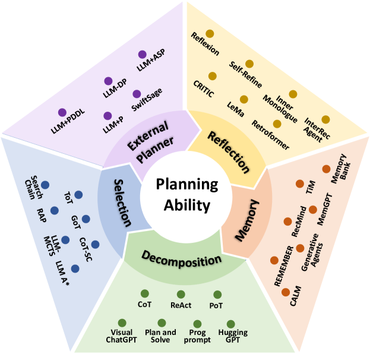 
- 提高处理复杂的图形推理任务的准确性
    - GraphAgent-Reasoner（GAR），这是一个基于多智能体协作的框架，通过将图问题分解为多个智能体可以协作解决的更小、以节点为中心的任务来提高图推理的准确性。

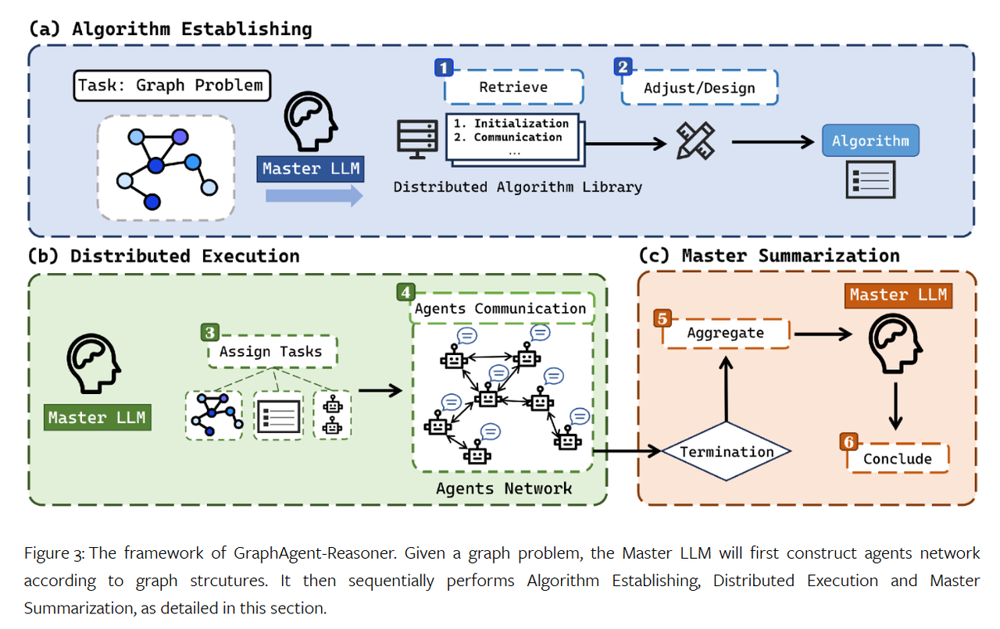 

### 2. 实际发展
**（1）目前市场上最先进或最主流的案例**   
**国际：**  
1. **OpenAI的AutoGPT**：AutoGPT是一个知名的AI Agent项目，在GitHub上获得了超过168K star。
   1. Auto-GPT 的工作原理类似于 ChatGPT，但增加了 AI 代理的功能。可以对 AI 代理进行编程，以根据一组规则和预定义目标做出决策并采取行动。
   2. Auto-GPT 和 ChatGPT 建立在相同的技术之上，但它们的功能差异很大。两者之间的主要区别在于 Auto-GPT 可以在不需要人工代理的情况下自主运行，而 ChatGPT 需要人工提示才能运行。
   3. Auto-GPT 仍然是一个实验项目，可能需要一段时间才能得到广泛应用。然而，该技术在实际应用方面具有巨大的潜力，例如播客创建、投资分析和活动策划。Auto-GPT 的未来发展潜力令人兴奋，尤其是随着 AI 技术的进步。凭借做出自主决策的能力，AI 代理可以帮助企业和个人优化运营并更有效地实现目标。
2. **微软的AutoGen**：AutoGen允许多个LLM智能体通过聊天来解决任务，展示了AI Agent在多智能体协作方面的潜力。
   AutoGen 提供了一个统一的多代理对话框架，作为使用基础模型的高级抽象。它具有功能强大、可定制和可交谈的代理，这些代理通过自动代理聊天集成LLMs、工具和人工。通过在多个有能力的代理之间自动聊天，可以轻松地让他们自主或通过人工反馈共同执行任务，包括需要通过代码使用工具的任务。该框架简化了复杂的 LLM。它最大限度地提高了 LLM并克服了它们的弱点。它支持以最少的工作量构建基于多代理对话的下一代 LLM 应用程序。
 

**国内：**
1. **百度的文心智能体**：百度推出的文心智能体平台支持开发者根据自身行业领域和应用场景，低成本开发智能体。
  - 出现时间
    - 2023.09 灵境矩阵发布上线
    - 2023.12  灵境矩阵从「文心大模型插件平台」升级为「文心大模型智能体平台」
    - 2024.04 品牌更名升级为：AgentBuilder文心智能体平台
   - 主要功能
  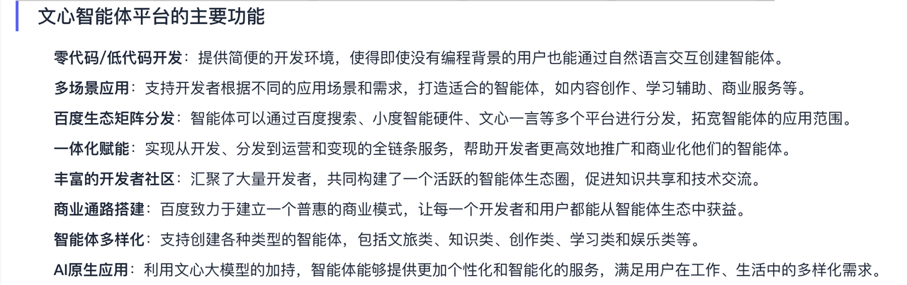 
   - 页面展示
  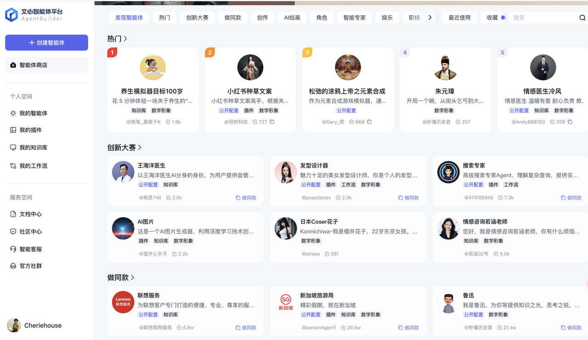   

2. **阿里的钉钉魔法棒**：钉钉推出的智能办公助手，内置于钉钉系统内部，集成了聊天AI、文档AI、会议AI等功能。
   - 发布时间：
     - 2023.04.18 首次亮相，在发布会上，钉钉展示了“魔法棒”在群聊、文档、视频会议和应用开发四个应用场景中的AI能力。  
     - 2023.5.31 钉钉“魔法棒”的阶段性成果开始邀请用户测试体验, 其中包括群消息摘要、答疑机器人、文生文、文生图、文生表格（PC端）、对话生成投票酷应用、拍照生成应用、会议闪记摘要（PC端）等功能。  
     - 2023.11.03 钉钉魔法棒正式上线，开放了17项产品、60+场景全面开放测试，这包括聊天、文档、知识库、脑图、闪记、Teambition等功能，并且提供了近100项AI技能，如智能问答、聊天摘要、文档创作、应用生成等。  
     - 2024.01.09 钉钉更新了关于配置魔法棒应用的文档，介绍了如何创建和配置魔法棒应用，以及如何发布和启用AI能力。  
     - 2024.01.10 钉钉发布了全新的7.5版本，并全量上线了AI助理产品，这是钉钉“魔法棒”的进一步升级，成为调用钉钉几乎所有功能的入口。  
   - 主要功能：
     - 智能问答：智能化主导服务全流程，实现服务沟通到企业知识沉淀，搭建钉钉端内/端外一体服务体系，为企业提供智能+人工一站式服务产品。  
     - 智能问数：支持数据库、本地文件等多类数据的接入，智能生成透视表、图表，随时随地洞察数据趋势，助力决策。  
     - 工单协同：智能感知并分析问题，自动指派问题跟进人，结构化沉淀问题数据，实现用 AI 驱动工单服务的全流程。  
     - 舆情监测：实时监控全网舆情，智能过滤并分析信息，并支持 AI 主动化回复客户反馈，提升产品口碑和影响力。 
   
**（2）终端AI智能体**
**1. PC端：联想**
- AI智能体会从用户在设备上的个人知识库中提取相关信息、提供答案、分解任务、制定执行计划，开放的生态系统相连、支持异构计算，并确保隐私和数据安全。最终，它会成为你个人的AI双胞胎。联想的核心理念是基于这样的个人AI智能体，实现横跨多个设备、横跨多个生态系统的无缝、安全的AI体验。  
- 正式发布了联想AI Now——联想PC上的个人AI智能体。个人计算正在转变为人工智能支持的个性化计算。  
**2. 移动端：vivo智能体**
- 2024.10.10发布  
- PhoneGPT背后是vivo的新AI战略——蓝心智能。蓝心智能从三个方面重构了系统体验：
  - 人与设备的交互体验：利用蓝心大模型的优势，PhoneGPT能够更加自然地理解用户的意图和需求，提供直观的反馈。
  - 人与数字世界的服务体验：通过分析用户数据，PhoneGPT能够主动推荐服务和功能，真正做到个性化。
  - 人与物理世界的连接体验：例如，vivo已经推出的读谱功能，使视障用户能够通过手机进行乐谱学习，展现了其在社会关怀方面的努力。
- PhoneGPT主要功能和特点：
  - 自主拆解需求：PhoneGPT能够理解用户的指令和需求，并将其拆解为可执行的任务。
  - 主动规划路径：智能体可以为用户规划完成任务的最优路径，提高效率。
  - 实时环境识别：通过实时识别用户所处的环境，PhoneGPT能够提供更加贴合场景的服务。
  - 动态反馈决策：智能体能够根据环境变化和任务执行情况，动态调整决策，以应对不同情况。

**（3）中译语通军工大模型**
格物3.0:大模型+思维链推理智能体 ———— 认知规划+反思优化+行业工具使用+多智能体协同。  
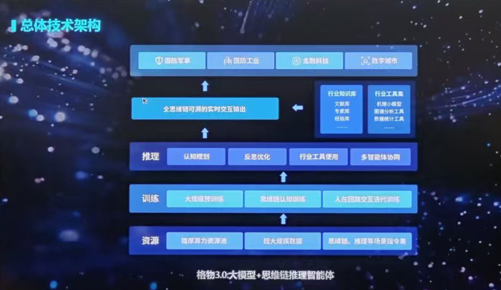 

多个Agent拥有不同的角色和责任，使它们能够协调行动，共同实现共同目标。这种结构减轻了单个智能体的负担，从而增强了任务性能。  

**（4）启发**
- **思维链推理**：利用思维链提示（Chain-of-Thought Prompting）来引导模型生成中间推理步骤。这些步骤可以是一系列逻辑推理，也可以是问题分解成的子问题。通过这种方式，模型可以逐步构建对数据背后含义的理解；  
- **多Agent系统**：设计一个包含多个智能体的系统，每个智能体负责不同的任务或具有不同的专长。这些智能体可以相互通信和协作，以解决复杂的推理任务。  
- 利用上述两个技术，可以让大模型更好地理解数据相对复杂的标注，更有效地从数据中提取有价值的信息，并推理出数据背后所想表达的真正含义。  